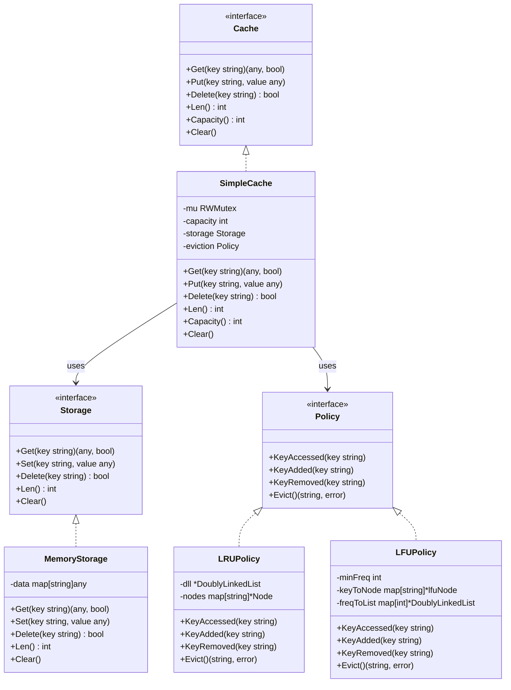
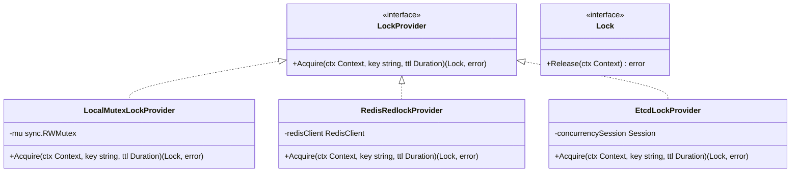

# In-Memory Cache System (Low-Level Design in Go)

A clean, scalable, thread-safe In-Memory Cache designed for **SDE-2 low-level design (LLD) interviews**. It demonstrates clean architecture, **SOLID principles**, and the **Strategy Design Pattern** for swappable eviction policies (LRU and LFU) with $O(1)$ time complexity.

---

## 1. Requirements

### Functional Requirements
- `Get(key)`: Retrieve a value by key. Updates eviction metadata on access.
- `Put(key, value)`: Insert or update a key-value pair. If capacity is full, evict a key according to the configured eviction strategy.
- `Delete(key)`: Remove a key-value pair and notify the eviction tracker.
- `Len()`: Return current item count.
- `Capacity()`: Return maximum capacity.
- `Clear()`: Invalidate all cache entries.

### Non-Functional Requirements
- **Thread Safety**: Concurrent reads and writes are safe using Go mutexes (`sync.RWMutex`).
- **O(1) Time Complexity**: `Get`, `Put`, `Delete`, and `Evict` operations run in $O(1)$ time.
- **Extensibility**: Easily add new eviction policies (FIFO, TTL, ARC) or distributed synchronization without modifying existing cache logic.

---

## 2. Architecture & Class Diagram



---

## 3. Design Patterns Used

### 1. Strategy Pattern (`eviction.Policy`)
- **Intent**: Define a family of algorithms, encapsulate each one, and make them interchangeable.
- **Application**: The `Policy` interface encapsulates eviction algorithms. `SimpleCache` does not care whether `LRUPolicy` or `LFUPolicy` is used. Eviction logic can be swapped at runtime or construction.

### 2. Repository / Storage Abstraction (`storage.Storage`)
- **Intent**: Decouple the underlying storage mechanism from business and eviction logic.
- **Application**: `Storage` abstracts raw key-value store operations (`MemoryStorage` using Go `map[string]any`). If persistence or a different underlying map is needed in the future, it can be plugged in without changing cache logic.

---

## 4. SOLID Principles Mapping

| Principle | How It's Applied in this Design |
| :--- | :--- |
| **S - Single Responsibility** | `Storage` handles data storage; `Policy` handles eviction candidate tracking; `SimpleCache` coordinates thread safety, capacity checks, and delegating calls. |
| **O - Open/Closed** | Open for extension (new policies like FIFO or TTL can be added), closed for modification (core cache logic remains untouched). |
| **L - Liskov Substitution** | Any implementation of `Policy` (`LRUPolicy`, `LFUPolicy`) can replace each other without breaking `SimpleCache`. |
| **I - Interface Segregation** | Small, focused, role-based interfaces (`Cache`, `Storage`, `Policy`, `LockProvider`). |
| **D - Dependency Inversion** | `SimpleCache` depends on abstractions (`storage.Storage`, `eviction.Policy`, `LockProvider`), not concrete structs. |

---

## 5. Eviction Algorithms & Data Structures

### A. LRU (Least Recently Used) — $O(1)$
- **Data Structures**:
  - `DoublyLinkedList`: Tracks access recency (Sentinel Head = Most Recently Used, Sentinel Tail = Least Recently Used).
  - `map[string]*Node`: Direct $O(1)$ pointer access to nodes in the list.
- **Flow**:
  - `KeyAccessed(k)` / `KeyAdded(k)`: Move/add node to the head of the DLL ($O(1)$).
  - `Evict()`: Pop node from the tail of the DLL and delete from the map ($O(1)$).

### B. LFU (Least Frequently Used) — $O(1)$
- **Data Structures**:
  - `keyToNode map[string]*lfuNode`: Stores key metadata (`key`, `freq`, pointer to list node).
  - `freqToList map[int]*DoublyLinkedList`: Maps each frequency count to a doubly linked list of keys having that frequency.
  - `minFreq int`: Tracks the current minimum frequency in the cache.
- **Tie-Breaking**: Ties between items with the same frequency are broken using **LRU** within that frequency list.
- **Flow**:
  - `KeyAdded(k)`: Add to `freqToList[1]`, set `minFreq = 1` ($O(1)$).
  - `KeyAccessed(k)`: Remove from `freqToList[oldFreq]`; if `oldFreq == minFreq` and that list becomes empty, `minFreq++`. Move to `freqToList[oldFreq + 1]` ($O(1)$).
  - `Evict()`: Pop the tail (LRU item) from `freqToList[minFreq]` ($O(1)$).

---

## 6. Project Structure

```
cache/
├── go.mod
├── internal/
│   └── list/
│       └── dll.go         # Generic doubly linked list with sentinel nodes
├── storage/
│   └── storage.go         # Storage interface & in-memory map implementation
├── eviction/
│   ├── policy.go          # Eviction strategy interface
│   ├── lru.go             # LRU strategy O(1)
│   └── lfu.go             # LFU strategy O(1)
├── core/
│   └── cache.go           # Thread-safe Cache orchestrator
├── main.go                # Example execution & demo
└── README.md              # Documentation & Design
```

---

## 7. How to Run

```bash
go run main.go
```

**Expected Output:**
```
=== 1. LRU Cache Demo ===
Get 'B' (evicted): found=false
Get 'A': val=100, found=true
Get 'D': val=400, found=true
Current Cache Size: 3 / 3

=== 2. LFU Cache Demo ===
Get 'banana' (evicted): found=false
Get 'apple': val=fruit, found=true
Get 'date': val=fruit, found=true
Current Cache Size: 3 / 3
```

---

## 8. Complexity Analysis

| Operation | LRU | LFU | Space |
| :--- | :--- | :--- | :--- |
| `Get(key)` | $O(1)$ | $O(1)$ | $O(1)$ |
| `Put(key, value)` | $O(1)$ | $O(1)$ | $O(1)$ |
| `Delete(key)` | $O(1)$ | $O(1)$ | $O(1)$ |
| `Evict()` | $O(1)$ | $O(1)$ | $O(1)$ |
| **Overall Space** | $O(N)$ | $O(N)$ | $O(N)$ where $N$ is capacity |

---

## 9. Extending to Distributed Locking (`LockProvider`)

In a **single-node in-memory cache**, synchronization is achieved using `sync.RWMutex`. 

However, in a **distributed / multi-instance environment**, multiple application servers share or coordinate access to keys. A local mutex cannot synchronize across machines. To solve this without coupling the cache to a specific technology (e.g., Redis, etcd, ZooKeeper), we introduce the **`LockProvider` interface** following the **Dependency Inversion Principle (DIP)**.

### A. `LockProvider` Interface Definition

```go
package lock

import (
	"context"
	"time"
)

// Lock represents an acquired lock handle.
type Lock interface {
	// Release unlocks the resource.
	Release(ctx context.Context) error
}

// LockProvider defines the strategy for acquiring distributed or local locks.
type LockProvider interface {
	// Acquire tries to acquire a lock for the given resource key within a TTL.
	Acquire(ctx context.Context, key string, ttl time.Duration) (Lock, error)
}
```

---

### B. Pluggable Implementations



1. **`LocalMutexLockProvider`** (Single-Instance):
   - Uses local `sync.RWMutex` or a striped mutex map for local in-process concurrency.
2. **`RedisRedlockProvider`** (Distributed):
   - Uses Redis `SET resource_key token NX PX <ttl>` and Lua scripts for atomic release.
3. **`EtcdLockProvider` / `ZookeeperLockProvider`** (Distributed Consensus):
   - Uses raft-based distributed leases and ephemeral nodes.

---

### C. Integrating `LockProvider` into `SimpleCache`

Replace `sync.RWMutex` in `SimpleCache` with `lock.LockProvider`:

```go
type DistributedCache struct {
	capacity     int
	storage      storage.Storage
	eviction     eviction.Policy
	lockProvider lock.LockProvider // Injected interface
	lockTTL      time.Duration
}

func NewDistributedCache(
	capacity int,
	policy eviction.Policy,
	store storage.Storage,
	lockProvider lock.LockProvider,
	lockTTL time.Duration,
) *DistributedCache {
	return &DistributedCache{
		capacity:     capacity,
		storage:      store,
		eviction:     policy,
		lockProvider: lockProvider,
		lockTTL:      lockTTL,
	}
}

func (c *DistributedCache) Put(ctx context.Context, key string, value any) error {
	// 1. Acquire distributed lock for this key
	lock, err := c.lockProvider.Acquire(ctx, key, c.lockTTL)
	if err != nil {
		return fmt.Errorf("failed to acquire distributed lock for key %s: %w", key, err)
	}
	defer lock.Release(ctx)

	// 2. Perform safe read-modify-write / eviction
	if _, exists := c.storage.Get(key); exists {
		c.storage.Set(key, value)
		c.eviction.KeyAccessed(key)
		return nil
	}

	if c.storage.Len() >= c.capacity && c.capacity > 0 {
		if victim, err := c.eviction.Evict(); err == nil {
			c.storage.Delete(victim)
		}
	}

	c.storage.Set(key, value)
	c.eviction.KeyAdded(key)
	return nil
}
```

---

## 10. SDE-2 Interview Follow-up Topics

If the interviewer asks for follow-ups, here are standard discussion points:
1. **Lock Contention / Scaling**:
   - Under heavy concurrency on a single node, we can introduce a **Sharded Cache** where keys are partitioned across $N$ shards using `hash(key) % N`, each with its own mutex.
2. **TTL (Time-To-Live) / Expiration**:
   - Add an expiration timestamp to entries. Use a min-heap or active background cleanup goroutine + passive cleanup on `Get()`.
3. **Write-Through / Write-Back Persistence**:
   - Create a new `Storage` implementation that delegates to an external DB or disk.
4. **Cache Stampede / Thundering Herd**:
   - When a hot key expires, multiple concurrent requests might compute/query the DB simultaneously. `LockProvider` (mutex per key or singleflight pattern) prevents duplicate backend queries.
