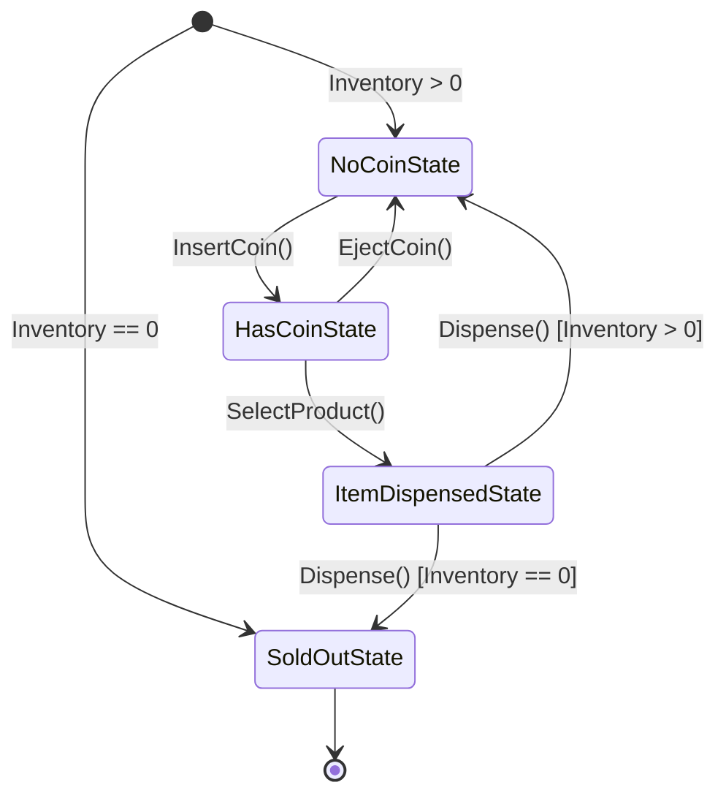

# State Design Pattern in Go

The **State Pattern** is a behavioral design pattern that allows an object to alter its behavior when its internal state changes. The object will appear to change its class.

---

## 📌 Problem & Intent

In software applications, objects often have different behaviors depending on their current state. For example, a Vending Machine behaves differently when it has coins inserted versus when it is empty.

### The Naive Approach
Without the State pattern, stateful behavior is typically managed using large conditional statements (`if-else` or `switch` blocks):

```go
func (v *VendingMachine) InsertCoin() {
    if v.state == "NO_COIN" {
        v.state = "HAS_COIN"
    } else if v.state == "HAS_COIN" {
        fmt.Println("Coin already inserted")
    } else if v.state == "SOLD_OUT" {
        fmt.Println("Machine is sold out")
    }
}
```

### Why Naive Approach Fails
- **Violation of Open/Closed Principle**: Adding a new state requires editing existing methods everywhere.
- **Maintainability Nightmare**: Code grows bloated with repetitive state-checking logic.
- **High Coupling**: State transition rules are scattered across massive conditional branches.

### The State Pattern Solution
Encapsulate state-specific behaviors inside distinct state structs that implement a common interface. The context object (`VendingMachine`) delegates state-specific requests to its current state object.

---

## 🏗️ Architecture & Structure

```
                  ┌──────────────────────┐
                  │    State (Interface) │
                  ├──────────────────────┤
                  │ + InsertCoin()       │
                  │ + EjectCoin()        │
                  │ + SelectProduct()    │
                  │ + Dispense()         │
                  └──────────▲───────────┘
                             │
     ┌───────────────────────┼───────────────────────┐
     │                       │                       │
┌────┴────────────┐  ┌───────┴──────────┐  ┌─────────┴─────────┐
│  NoCoinState    │  │   HasCoinState   │  │ItemDispensedState │
└─────────────────┘  └──────────────────┘  └───────────────────┘
```

1. **Context (`VendingMachine`)**: Defines the interface of interest to clients. Maintains a reference to an instance of a Concrete State subclass that defines the current state.
2. **State (`State` Interface)**: Defines an interface for encapsulating the behavior associated with a particular state of the Context.
3. **Concrete States (`NoCoinState`, `HasCoinState`, `ItemDispensedState`, `SoldOutState`)**: Each struct implements a behavior associated with a state of the Context and manages transitions to other states.

---

## 🔄 State Transition Diagram (Vending Machine)



---

## 💡 Real-World Use Cases

1. **Vending Machines / ATMs**: Handling coin insertion, PIN authentication, account selection, and cash dispensing based on machine status.
2. **E-Commerce Order Lifecycle**:
   - `OrderPending` $\rightarrow$ `OrderPaid` $\rightarrow$ `OrderShipped` $\rightarrow$ `OrderDelivered` / `OrderCancelled`.
3. **TCP Connection Management**:
   - Connections transitioning between `CLOSED`, `LISTEN`, `SYN_SENT`, `ESTABLISHED`, and `FIN_WAIT`.
4. **Document Publishing Workflows**:
   - `Draft` $\rightarrow$ `UnderReview` $\rightarrow$ `Approved` $\rightarrow$ `Published`.
5. **Media Player Controllers**:
   - Action of the "Play/Pause" button changes depending on whether audio is `Playing`, `Paused`, or `Stopped`.

---

## 💻 Go Implementation Example

The example in this directory models a **Vending Machine State System**.

### Project Structure
```text
state_pattern/
├── go.mod
├── main.go
└── vending_machine/
    ├── vending_machine.go         # Context & State Interface
    ├── no_coin_state.go           # Concrete State: Idle / Waiting for Coin
    ├── has_coin_state.go          # Concrete State: Coin Inserted
    ├── item_dispensed_state.go    # Concrete State: Product Dispensing
    └── sold_out_state.go          # Concrete State: Out of Stock
```

### Code Overview

#### 1. State Interface (`vending_machine/vending_machine.go`)
```go
package vending_machine

type State interface {
	InsertCoin() error
	EjectCoin() error
	SelectProduct() error
	Dispense() error
}
```

#### 2. Concrete State Example (`vending_machine/has_coin_state.go`)
```go
package vending_machine

import "fmt"

type HasCoinState struct {
	vendingMachine *VendingMachine
}

func (s *HasCoinState) SelectProduct() error {
	fmt.Println("--> Action: SelectProduct -> Product selected.")
	s.vendingMachine.SetState(s.vendingMachine.GetItemDispensedState())
	return nil
}
```

#### 3. Context (`vending_machine/vending_machine.go`)
```go
type VendingMachine struct {
	hasCoinState       State
	noCoinState        State
	itemDispensedState State
	soldOutState       State

	currentState State
	itemCount    int
}

func (v *VendingMachine) SelectProduct() error {
	err := v.currentState.SelectProduct()
	if err != nil {
		return err
	}
	return v.currentState.Dispense()
}
```

---

## 🚀 How to Run

Navigate to this directory and run:

```bash
go run main.go
```

### Sample Output
```text
==========================================
     State Pattern Demo: Vending Machine  
==========================================
Current state: *vending_machine.NoCoinState, Items remaining: 2

[Scenario 1] Normal Purchase:
--> Action: InsertCoin -> Coin inserted successfully.
--> Action: SelectProduct -> Product selected.
--> Action: Dispense -> Item dispensed. Enjoy!
Current state: *vending_machine.NoCoinState, Items remaining: 1

[Scenario 2] Insert Coin and Eject:
--> Action: InsertCoin -> Coin inserted successfully.
--> Action: EjectCoin -> Coin returned.
Current state: *vending_machine.NoCoinState, Items remaining: 1

[Scenario 3] Invalid Action (Selecting product without coin):
ERROR: cannot select product: please insert a coin first

[Scenario 4] Purchase Final Item:
--> Action: InsertCoin -> Coin inserted successfully.
--> Action: SelectProduct -> Product selected.
--> Action: Dispense -> Item dispensed. Enjoy!
--> System Alert: Vending machine is now out of stock!
Current state: *vending_machine.SoldOutState, Items remaining: 0

[Scenario 5] Action on Sold-out Machine:
ERROR: cannot insert coin: machine is out of stock
ERROR: cannot select product: machine is out of stock
```

---

## ⚖️ Trade-offs

| Advantages | Disadvantages |
| :--- | :--- |
| **Single Responsibility Principle**: Organizes state-specific code into separate types. | **Increased Code Complexity**: Can be overkill if a state machine has only a few simple states that rarely change. |
| **Open/Closed Principle**: Introduce new states without modifying existing state logic or context. | **More Types/Files**: Creates multiple small structs/files for each state. |
| **Simplifies Context Code**: Removes monolithic `switch` / `if-else` blocks. | |
