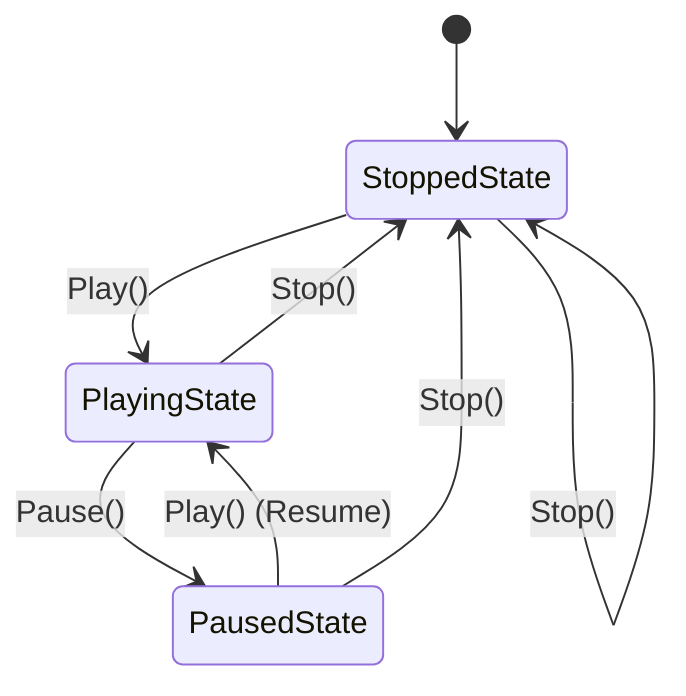
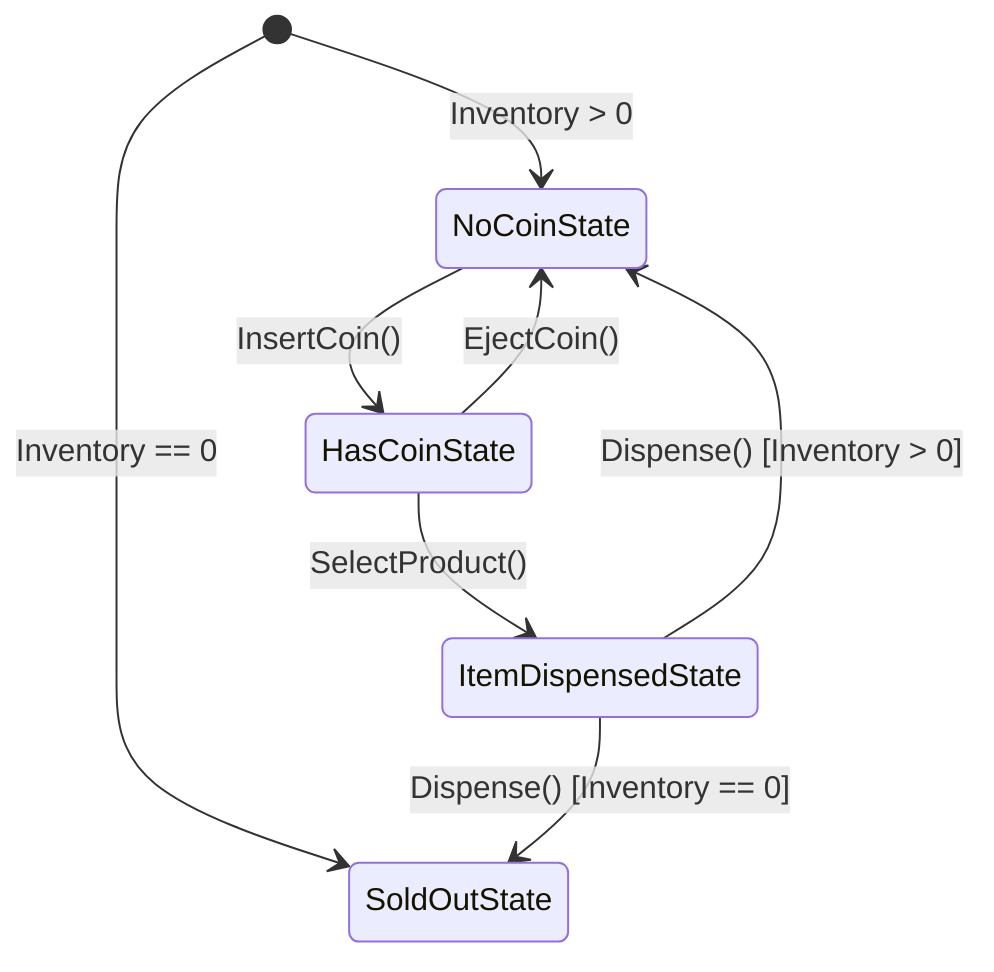

# State Design Pattern in Go

The **State Pattern** is a behavioral design pattern that allows an object to alter its behavior when its internal state changes. The object will appear to change its class.

---

## 📌 Problem & Intent

In software applications, objects often have different behaviors depending on their current state. For example, a Music Player's `Play`, `Pause`, and `Stop` buttons behave completely differently depending on whether music is currently playing, paused, or stopped.

### The Naive Approach
Without the State pattern, stateful behavior is typically managed using large conditional statements (`if-else` or `switch` blocks):

```go
func (p *MusicPlayer) PressPlay() {
    if p.state == "STOPPED" {
        p.startPlayback()
        p.state = "PLAYING"
    } else if p.state == "PAUSED" {
        p.resumePlayback()
        p.state = "PLAYING"
    } else if p.state == "PLAYING" {
        fmt.Println("Already playing")
    }
}
```

### Why Naive Approach Fails
- **Violation of Open/Closed Principle**: Adding a new state (e.g., `Buffering`, `FastForwarding`) requires editing existing methods everywhere.
- **Maintainability Nightmare**: Code grows bloated with repetitive state-checking logic.
- **High Coupling**: State transition rules are scattered across massive conditional branches.

### The State Pattern Solution
Encapsulate state-specific behaviors inside distinct state structs that implement a common interface. The context object (`MusicPlayer` / `VendingMachine`) delegates state-specific requests to its current state object.

---

## 🏗️ Architecture & Structure

```
                  ┌──────────────────────┐
                  │    State (Interface) │
                  ├──────────────────────┤
                  │ + Play()             │
                  │ + Pause()            │
                  │ + Stop()             │
                  │ + NextTrack()        │
                  │ + PreviousTrack()    │
                  └──────────▲───────────┘
                             │
     ┌───────────────────────┼───────────────────────┐
     │                       │                       │
┌────┴────────────┐  ┌───────┴──────────┐  ┌─────────┴─────────┐
│  StoppedState   │  │   PlayingState   │  │    PausedState    │
└─────────────────┘  └──────────────────┘  └───────────────────┘
```

1. **Context (`MusicPlayer`)**: Maintains a reference to an instance of a Concrete State struct defining the current state.
2. **State (`State` Interface)**: Declares operations common to all concrete states.
3. **Concrete States (`StoppedState`, `PlayingState`, `PausedState`)**: Implement behaviors associated with a particular state of the Context.

---

## 🔄 State Transition Diagrams

### 🎵 Music Player State Machine



### 🥤 Vending Machine State Machine



---

## 💡 Real-World Use Cases

1. **Media / Audio Players**: Handling `Play`, `Pause`, `Stop`, and `Track Navigation` based on current playback state.
2. **Vending Machines / ATMs**: Handling coin insertion, PIN authentication, product selection, and cash dispensing based on machine status.
3. **E-Commerce Order Lifecycle**:
   - `OrderPending` $\rightarrow$ `OrderPaid` $\rightarrow$ `OrderShipped` $\rightarrow$ `OrderDelivered` / `OrderCancelled`.
4. **TCP Connection Management**:
   - Connections transitioning between `CLOSED`, `LISTEN`, `SYN_SENT`, `ESTABLISHED`, and `FIN_WAIT`.
5. **Workflow / Document Publishing**:
   - `Draft` $\rightarrow$ `UnderReview` $\rightarrow$ `Approved` $\rightarrow$ `Published`.

---

## 💻 Go Implementation Examples

This directory includes two complete implementations:
1. **Music Player State System** (`music_player/`)
2. **Vending Machine State System** (`vending_machine/`)

### Project Structure
```text
state_pattern/
├── go.mod
├── main.go
├── music_player/
│   ├── player.go                  # Context & State Interface for Music Player
│   ├── stopped_state.go           # Concrete State: Stopped
│   ├── playing_state.go           # Concrete State: Playing
│   └── paused_state.go            # Concrete State: Paused
└── vending_machine/
    ├── vending_machine.go         # Context & State Interface for Vending Machine
    ├── no_coin_state.go           # Concrete State: Waiting for Coin
    ├── has_coin_state.go          # Concrete State: Coin Inserted
    ├── item_dispensed_state.go    # Concrete State: Product Dispensing
    └── sold_out_state.go          # Concrete State: Out of Stock
```

### Music Player Code Highlights

#### 1. State Interface & Context (`music_player/player.go`)
```go
package music_player

type State interface {
	Play() error
	Pause() error
	Stop() error
	NextTrack() error
	PreviousTrack() error
}

type MusicPlayer struct {
	stoppedState State
	playingState State
	pausedState  State

	currentState      State
	playlist          []string
	currentTrackIndex int
}
```

#### 2. Playing State (`music_player/playing_state.go`)
```go
package music_player

import "fmt"

type PlayingState struct {
	player *MusicPlayer
}

func (s *PlayingState) Pause() error {
	fmt.Printf("--> [PlayingState] Pausing playback of \"%s\"\n", s.player.GetCurrentTrack())
	s.player.SetState(s.player.GetPausedState())
	return nil
}

func (s *PlayingState) Stop() error {
	fmt.Println("--> [PlayingState] Stopping playback.")
	s.player.SetState(s.player.GetStoppedState())
	return nil
}
```

---

## 🚀 How to Run

Navigate to this directory and run:

```bash
go run main.go
```

### Sample Output (Music Player Demo)
```text
==========================================
     State Pattern Demo 2: Music Player   
==========================================
State: *music_player.StoppedState | Current Track: "Bohemian Rhapsody - Queen"

[Action] Press Play:
--> [StoppedState] Starting playback of "Bohemian Rhapsody - Queen"
State: *music_player.PlayingState | Current Track: "Bohemian Rhapsody - Queen"

[Action] Next Track:
--> [PlayingState] Playing next track: "Hotel California - Eagles"
State: *music_player.PlayingState | Current Track: "Hotel California - Eagles"

[Action] Press Pause:
--> [PlayingState] Pausing playback of "Hotel California - Eagles"
State: *music_player.PausedState | Current Track: "Hotel California - Eagles"

[Action] Try Pausing Again:
--> [PausedState] Player is already paused.

[Action] Resume Playback:
--> [PausedState] Resuming playback of "Hotel California - Eagles"
State: *music_player.PlayingState | Current Track: "Hotel California - Eagles"

[Action] Press Stop:
--> [PlayingState] Stopping playback.
State: *music_player.StoppedState | Current Track: "Hotel California - Eagles"

[Action] Try Pausing While Stopped:
ERROR: cannot pause: player is currently stopped
```

---

## ⚖️ Trade-offs

| Advantages | Disadvantages |
| :--- | :--- |
| **Single Responsibility Principle**: Organizes state-specific code into separate types. | **Increased Code Complexity**: Can be overkill if a state machine has only a few simple states that rarely change. |
| **Open/Closed Principle**: Introduce new states without modifying existing state logic or context. | **More Types/Files**: Creates multiple small structs/files for each state. |
| **Simplifies Context Code**: Removes monolithic `switch` / `if-else` blocks. | |
