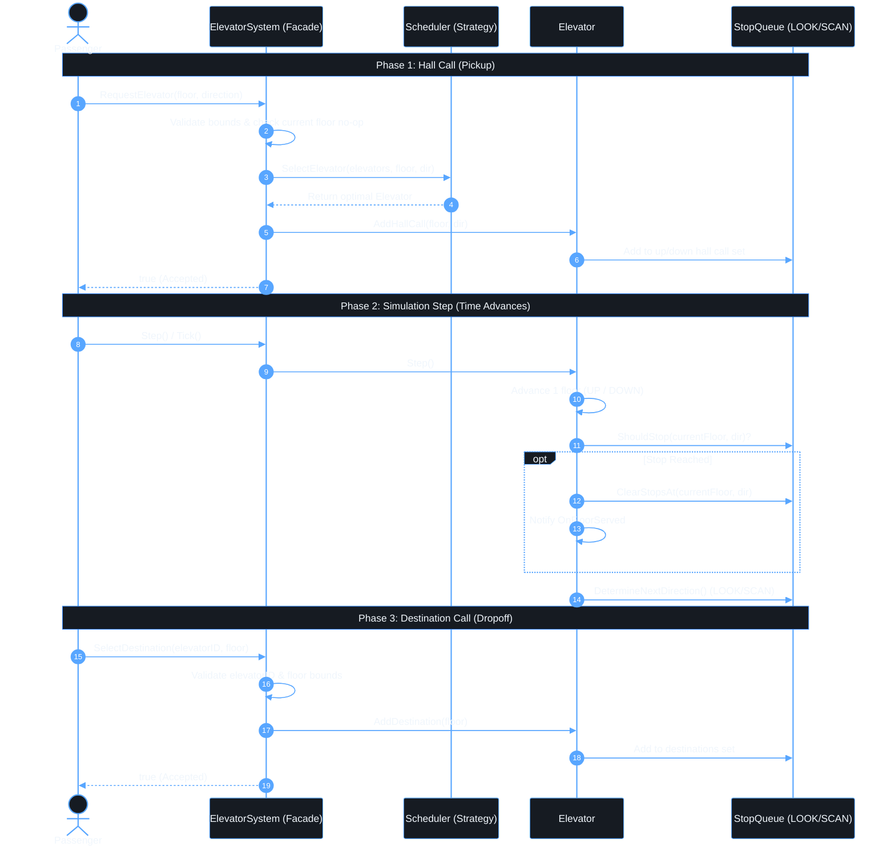

# Elevator System Simulation in Go

A concurrent, discrete-time elevator system simulation in Go designed using clean architecture, design patterns, and SOLID principles.

---

## 1. Overview

The system manages a fleet of **3 elevators** serving **10 floors (0–9)**. It processes both external hall calls (floor + direction) and internal destination requests (floor), schedules the optimal elevator using a proximity/direction heuristic, and deterministically advances time in discrete simulation steps.

---

## 2. Requirements & Compliance

| # | Requirement | Implementation |
|---|---|---|
| 1 | **3 Elevators & 10 Floors (0–9)** | Fixed fleet of 3 elevators serving floors `0` through `9`. |
| 2 | **Hall Call Dispatching** | Users can call an elevator from any floor with direction (`UP` or `DOWN`). The system dispatches using the `Scheduler` strategy. |
| 3 | **Destination Floor Selection** | Passengers inside an elevator can select one or more destination floors. |
| 4 | **Discrete Time Steps (`Step()` / `Tick()`)** | Deterministic simulation progression. Active elevators advance 1 floor per step. Real-time tickers and blocking sleeps are completely eliminated. |
| 5 | **Two Stop Types** | Distinct handling for **Hall Calls** (floor + direction) and **Destination Calls** (floor only). |
| 6 | **Concurrent Requests** | Thread-safe operations protected by `sync.RWMutex` across elevators and system dispatch. Verified with `-race`. |
| 7 | **Rejection of Invalid Requests** | Out-of-bounds floors (`< 0` or `> 9`), invalid elevator IDs, and impossible directions (`DOWN` from floor 0, `UP` from floor 9) return `false`. |
| 8 | **Current Floor Requests as No-Op** | Requests for an elevator's current floor are treated as already served and return `true` without unnecessary motion. |

### Out of Scope
- Weight capacity and passenger count limits
- Door open/close timing mechanics
- Emergency stop functionality
- Dynamic floor/elevator reconfiguration
- UI/rendering layer

---

## 3. Service Flow

The end-to-end flow consists of three distinct phases:



### Step-by-Step Execution:
1. **Hall Call (Pickup):**
   - `sys.RequestElevator(floor, dir)` validates input bounds (`0 <= floor <= 9`, valid directions).
   - If an idle elevator is already on `floor`, it is treated as a no-op / already served and returns `true`.
   - The `Scheduler` evaluates all elevators (idle distance, travel direction, and turnaround penalty) and picks the best elevator.
   - The selected elevator registers the pickup floor into its directional `StopQueue`.

2. **Discrete Stepping (`Step()` / `Tick()`):**
   - Each call to `sys.Step()` advances the clock by 1 tick for each elevator.
   - Active elevators move by 1 floor in their current direction.
   - At each floor, the elevator checks if it should stop (internal destination, matching hall call, or turnaround point).
   - When a stop is reached, it is served, cleared from the queue, and observers are notified.
   - If all stops are satisfied, the elevator transitions back to `StateIdle`.

3. **Destination Selection (Dropoff):**
   - Inside an elevator, `sys.SelectDestination(elevatorID, floor)` registers one or more destinations.
   - If the elevator is already at that floor, it returns `true` as a no-op.
   - The elevator seamlessly continues along its LOOK/SCAN trajectory until all destinations are served.

---

## 4. Component Responsibilities & File Structure

The codebase cleanly separates concerns across files, specifically defining clear responsibilities for **System**, **Elevator**, and **Queue**:

| Component | Primary File | Role & Key Responsibilities |
|---|---|---|
| **`ElevatorSystem`** | [`elevator/system.go`](elevator/system.go) | **Central Fleet Coordinator & Facade**<br>• **Fleet Management:** Manages and initializes the 3 `Elevator` instances.<br>• **Validation & Rejection (Req 7):** Validates floor boundaries (`0–9`), elevator IDs, and direction validity; rejects invalid requests by returning `false`.<br>• **Current Floor No-Op (Req 8):** Checks if an idle elevator is already at the requested floor to treat it as already served without dispatching redundant motion.<br>• **Hall Call Dispatching (Req 2):** Delegates external pickup requests to `Scheduler` to assign the optimal elevator.<br>• **Destination Routing (Req 3):** Routes passenger destination selections directly to the targeted elevator.<br>• **Discrete Step Orchestration (Req 4):** Advances the simulation for all elevators synchronously via `Step()` / `Tick()`.<br>• **Thread Safety (Req 6):** Synchronizes concurrent multi-passenger requests using `sync.RWMutex`. |
| **`Elevator`** | [`elevator/elevator.go`](elevator/elevator.go) | **Autonomous Elevator Cabin**<br>• **State & Position Tracking:** Maintains `currentFloor` (0–9), operational state (`Idle`, `MovingUp`, `MovingDown`), and moving direction.<br>• **State Machine Delegation:** Uses `ElevatorStateHandler` (State Pattern) to execute movement and transitions on each discrete `Step()`.<br>• **Request Ingestion:** Exposes `AddDestination` and `AddHallCall`, delegating stop storage to its internal `StopQueue`.<br>• **Event Notification:** Emits events to registered `ElevatorObserver` listeners (`OnElevatorFloorChanged`, `OnElevatorStateChanged`, `OnFloorServed`).<br>• **Cabin-Level Thread Safety:** Locks cabin access and state transitions with `sync.RWMutex`. |
| **`StopQueue`** | [`elevator/queue.go`](elevator/queue.go) | **LOOK/SCAN Stop Management & Path Planning**<br>• **Segregated Stop Storage (Req 5):** Tracks requests in distinct sets: `destinations` (internal), `upHallCalls` (external UP), and `downHallCalls` (external DOWN).<br>• **Stop Decisions (`ShouldStop`):** Decides if the cabin must stop at `currentFloor` based on direction, destination dropoffs, matching hall calls, or turnaround points.<br>• **Turnaround Detection (`HasStopsAbove`, `HasStopsBelow`):** Scans for remaining requests ahead to determine when the elevator reaches its highest or lowest requested floor.<br>• **Stop Clearance (`ClearStopsAt`):** Removes served stops; preserves opposite-direction calls until turnaround.<br>• **Direction Planning (`DetermineNextDirection`):** Decides whether the elevator continues forward, reverses direction, or idles. |

### Supporting Files
- **`elevator/states.go`**: Implements the State Pattern (`IdleState`, `MovingUpState`, `MovingDownState`) driving discrete movement step-by-step.
- **`elevator/scheduler.go`**: Implements the Strategy Pattern (`Scheduler` interface and `NearestElevatorScheduler`) calculating proximity and directional costs.
- **`elevator/types.go`**: Core domain constants (`MinFloor = 0`, `MaxFloor = 9`, `TotalElevators = 3`), enums (`Direction`, `ElevatorState`), `Config`, and observer interfaces.
- **`main.go`**: Executable simulation demo demonstrating hall calls, destination dropoffs, and discrete stepping.
- **`elevator/system_test.go`**: Test suite rigorously testing all 8 requirements and concurrent requests (`-race`).

---

## 5. Dispatching Scheduler & Algorithm Deep-Dive

The system uses the **Strategy Pattern** to separate the dispatch decision from the elevator mechanics.

### 5.1 The `Scheduler` Interface
Defined in [`elevator/scheduler.go`](elevator/scheduler.go):
```go
type Scheduler interface {
    SelectElevator(elevators []*Elevator, floor int, dir Direction) *Elevator
}
```
By depending on this interface, the system can swap dispatch algorithms (e.g., Round Robin, ETA-based, or Destination Dispatch) without changing a single line in `ElevatorSystem` or `Elevator` (**Open/Closed Principle**).

---

### 5.2 `NearestElevatorScheduler` Dispatch Algorithm

The default implementation evaluates each elevator using a **cost function** that estimates the delay/distance in discrete steps, taking into account travel direction and turnaround penalties:

$$\text{Best Elevator} = \arg\min_{e \in \text{elevators}} \text{Cost}(e, \text{floor}, \text{dir})$$

#### Cost Calculation Cases:

1. **Exact Match & Idle ($\text{Cost} = 0$):**
   - Elevator is already at the requested floor and is `Idle`.
   - Passenger can board immediately with zero waiting steps.

2. **Idle Elevator ($\text{Cost} = |\text{floor} - \text{currentFloor}|$):**
   - Elevator is stationary at another floor.
   - It only needs to travel directly to the pickup floor.

3. **In-Flight & Matching Direction (Zero-Detour Pickup):**
   - **Moving UP** and requested floor is ahead ($\text{floor} \ge \text{currentFloor}$) with $\text{dir} == \text{UP}$:
     $$\text{Cost} = \text{floor} - \text{currentFloor}$$
   - **Moving DOWN** and requested floor is ahead ($\text{floor} \le \text{currentFloor}$) with $\text{dir} == \text{DOWN}$:
     $$\text{Cost} = \text{currentFloor} - \text{floor}$$
   - *Why:* The elevator is already traveling past this floor in the passenger's desired direction. Stopping to pick them up introduces zero directional detour.

4. **In-Flight but Opposite Direction or Floor Passed (Turnaround Run):**
   - **Moving UP** but the floor is behind ($\text{floor} < \text{currentFloor}$) or the passenger wants to go $\text{DOWN}$:
     $$\text{Cost} = (\text{MaxFloor} - \text{currentFloor}) + (\text{MaxFloor} - \text{floor}) + 2$$
     *Explanation:* The elevator must first complete its upward run to its peak (`MaxFloor`), reverse direction ($+2$ turnaround penalty), and descend to the pickup floor.
   - **Moving DOWN** but the floor is behind ($\text{floor} > \text{currentFloor}$) or the passenger wants to go $\text{UP}$:
     $$\text{Cost} = (\text{currentFloor} - \text{MinFloor}) + (\text{floor} - \text{MinFloor}) + 2$$
     *Explanation:* The elevator must first complete its downward run to its trough (`MinFloor`), reverse direction ($+2$ turnaround penalty), and ascend to the pickup floor.

#### Tie-Breaking:
If multiple elevators evaluate to the identical lowest cost, the scheduler selects the elevator with the lowest ID deterministically.

---

### 5.3 LOOK / SCAN Elevator Trajectory Algorithm

While the `Scheduler` decides **which elevator** receives a call, each elevator's internal path is governed by the **LOOK algorithm** (an optimization of the classic SCAN / Elevator algorithm) implemented in [`elevator/queue.go`](elevator/queue.go) and [`elevator/states.go`](elevator/states.go).

```text
               ▲  Moving UP: Serves Destinations & UP Hall Calls
[Floor 0] ───► [Floor 3] ───► [Floor 5] ───► [Floor 8 (Peak Turnaround)]
                                                  │
                                                  ▼ Reverses direction
[Floor 2] ◄─── [Floor 4] ◄─── [Floor 7] ◄─────────┘
  Moving DOWN: Serves Destinations & DOWN Hall Calls
```

#### How the LOOK Algorithm Operates:
1. **Continuous Sweep:**
   - While moving **UP**, the elevator continues ascending as long as `HasStopsAbove(currentFloor)` is `true`. It stops only for internal destinations and `UP` hall calls.
   - While moving **DOWN**, the elevator continues descending as long as `HasStopsBelow(currentFloor)` is `true`. It stops only for internal destinations and `DOWN` hall calls.

2. **LOOK vs SCAN (Smart Turnaround):**
   - Traditional **SCAN** travels all the way to the building boundaries (Floor 0 and Floor 9) even if no calls exist there.
   - **LOOK** only travels as far as the **highest or lowest requested floor**.
   - When going UP, as soon as `!HasStopsAbove(currentFloor)` is reached, the elevator recognizes it is at the peak stop. It clears any `DOWN` call at this floor, reverses direction to `DOWN`, and begins descending immediately.

3. **Starvation & Thrashing Prevention:**
   - Calls in the opposite direction are preserved in the queue and served on the return sweep.
   - Prevents the elevator from erratically bouncing back and forth between distant floors (First-Come-First-Serve thrashing).

---

## 6. Architecture & Design Patterns

### 6.1 Design Patterns
- **Facade Pattern (`ElevatorSystem`):** Acts as the primary interface for users and simulation runners, abstracting away elevators, scheduling, and request routing.
- **Strategy Pattern (`Scheduler`):** Decouples dispatching from system orchestration. Default strategy is `NearestElevatorScheduler` based on proximity, current direction, and turnaround costs.
- **State Pattern (`ElevatorStateHandler`):** Manages discrete transitions between `IdleState`, `MovingUpState`, and `MovingDownState`.
- **Observer Pattern (`ElevatorObserver`):** Enables external components to subscribe to floor arrivals and state changes.

### 6.2 SOLID Principles
- **Single Responsibility (SRP):**
  - `ElevatorSystem`: Orchestration, validation, dispatch coordination.
  - `Elevator`: Internal elevator state and step progression.
  - `StopQueue`: Directional stop tracking and LOOK/SCAN queries.
  - `NearestElevatorScheduler`: Optimal elevator selection.
- **Open/Closed (OCP):** New scheduling strategies (e.g., Round Robin, Energy Saving) can be implemented via the `Scheduler` interface without modifying existing code.
- **Liskov Substitution (LSP):** Any `Scheduler` implementation can seamlessly substitute the default scheduler.
- **Interface Segregation (ISP):** Minimal, focused interfaces (`Scheduler`, `ElevatorObserver`, `ElevatorStateHandler`).
- **Dependency Inversion (DIP):** `ElevatorSystem` depends on the `Scheduler` abstraction, not a concrete struct.

---

## 7. API Reference

### `ElevatorSystem`
```go
// Initialize system with 3 elevators and default nearest-car scheduler
sys := elevator.NewElevatorSystem(nil, nil)

// External hall call (returns false if invalid)
ok := sys.RequestElevator(floor int, dir elevator.Direction) bool

// Internal destination selection (returns false if invalid)
ok := sys.SelectDestination(elevatorID int, floor int) bool

// Advance simulation by 1 discrete time step
sys.Step() // or sys.Tick()

// Query elevators
elevators := sys.GetElevators()
e, ok := sys.GetElevator(id int)
```

---

## 8. Running the Simulation

### Run Demonstration
```bash
go run main.go
```

Sample output:
```text
=== Elevator Simulation Started (3 Elevators, Floors 0-9) ===

[Action] Hall call from floor 3 (Direction: UP)
--- Step 1 ---
Elevator 0 | Floor: 1 | State: MOVING_UP  | Direction: UP  
Elevator 1 | Floor: 0 | State: IDLE       | Direction: IDLE
Elevator 2 | Floor: 0 | State: IDLE       | Direction: IDLE
--- Step 2 ---
Elevator 0 | Floor: 2 | State: MOVING_UP  | Direction: UP  
Elevator 1 | Floor: 0 | State: IDLE       | Direction: IDLE
Elevator 2 | Floor: 0 | State: IDLE       | Direction: IDLE
--- Step 3 ---
Elevator 0 | Floor: 3 | State: IDLE       | Direction: IDLE
Elevator 1 | Floor: 0 | State: IDLE       | Direction: IDLE
Elevator 2 | Floor: 0 | State: IDLE       | Direction: IDLE

[Action] Passenger inside Elevator 0 selects floors 5 and 7
--- Step 4 ---
Elevator 0 | Floor: 4 | State: MOVING_UP  | Direction: UP  
...
```

### Run Tests
Includes unit tests verifying all 8 requirements and concurrent requests with Go's race detector:
```bash
go test -v -race ./...
```
