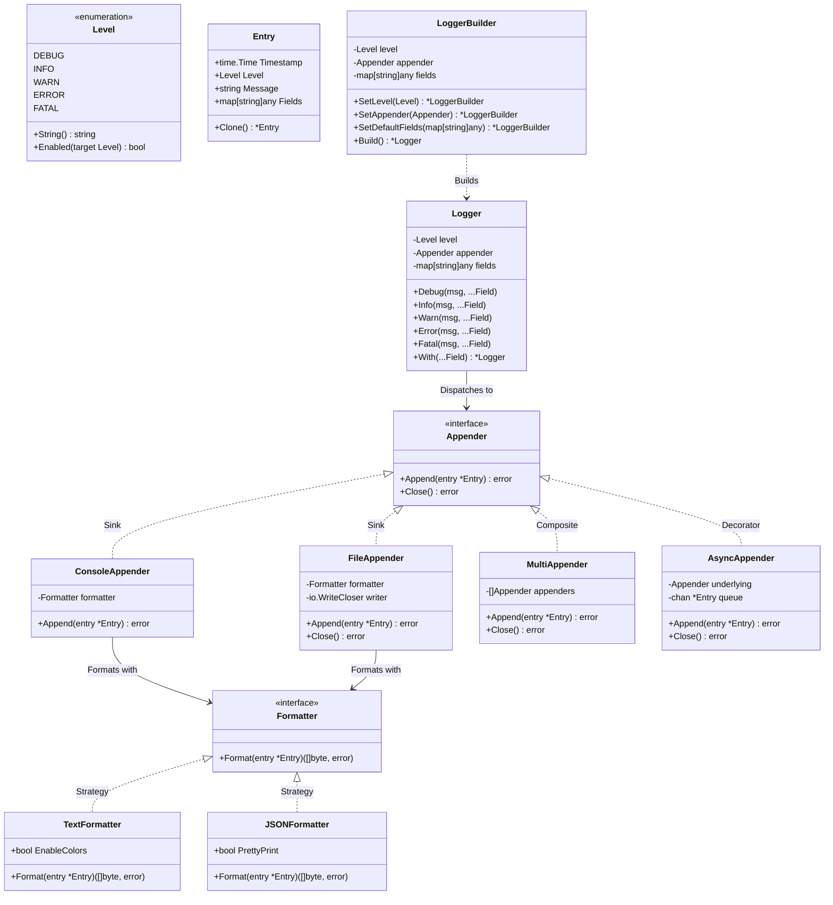

# Extensible Low-Level Design (LLD) Logger in Go

A clean, thread-safe, and modular logging library in Golang. Supports 5 severity levels, structured metadata key-values, customizable formatters (Text & JSON), and pluggable output destinations (Console, File, Composite Multi-Sink, and Async Worker Pool).

---

## 1. Requirements

- **5 Severity Levels**: `DEBUG`, `INFO`, `WARN`, `ERROR`, and `FATAL`.
- **Structured Metadata & Customizable Formats**:
  - Key-value metadata constructors (`String`, `Int`, `Float64`, `Bool`, `Duration`, `Err`, `Any`).
  - `TextFormatter` (colored/plain text with timestamp).
  - `JSONFormatter` (structured JSON).
- **Pluggable Destinations (Appenders/Sinks)**:
  - `ConsoleAppender`: Writes to `os.Stdout` / `os.Stderr`.
  - `FileAppender`: Thread-safe file persistence.
  - `MultiAppender`: Composite fan-out to multiple sinks simultaneously.
  - `AsyncAppender`: Non-blocking buffered queue with background worker pool.
- **Concurrency & Immutability**: Child loggers created via `Clone()` / `.With(...)` to avoid data races across goroutines.
- **Explicit Dependency Injection**: Clean `LoggerBuilder` with sensible defaults, avoiding global mutable state.

---

## 2. Design Patterns & Rationale

| Pattern | Component | Why It Was Chosen |
| :--- | :--- | :--- |
| **Builder Pattern** | [`LoggerBuilder`](logger.go) | Method chaining (`SetLevel`, `SetAppender`, `SetDefaultFields`, `Build`) with defaults (`InfoLevel`, empty fields). Eliminates complex parameter lists and closure functions. |
| **Strategy Pattern** | [`Formatter`](formatter/formatter.go) (`TextFormatter`, `JSONFormatter`) | Decouples formatting logic from destination sinks. |
| **Observer / Sink Pattern** | [`Appender`](appender/appender.go) (`ConsoleAppender`, `FileAppender`) | Decouples logging emission from destination targets. |
| **Composite Pattern** | [`MultiAppender`](appender/multi.go) | Dispatches log entries to multiple sinks simultaneously. |
| **Decorator Pattern** | [`AsyncAppender`](appender/async.go) | Wraps any sink with an asynchronous buffer queue and background workers. |
| **Prototype Pattern** | [`Logger.Clone()`](logger.go), `.With(...)` | Creates isolated child loggers for scoped metadata without data races. |

---

## 3. Architecture



---

## 4. Code Example

```go
package main

import (
	"time"

	"github.com/anunay/logger"
	"github.com/anunay/logger/appender"
	"github.com/anunay/logger/formatter"
)

func main() {
	// 1. Destinations (Console + File)
	consoleApp := appender.NewConsoleAppender(formatter.NewTextFormatter(true))
	fileApp, _ := appender.NewFileAppender("logs/app.log", formatter.NewJSONFormatter(false))
	defer fileApp.Close()

	multiApp := appender.NewMultiAppender(consoleApp, fileApp)

	// 2. Build Logger with Default + Custom Configs
	log := logger.NewBuilder().
		SetLevel(logger.DebugLevel).
		SetAppender(multiApp).
		SetDefaultFields(map[string]any{"service": "order-service"}).
		Build()

	// 3. Log Across Severity Levels
	log.Debug("Connecting to database", logger.String("host", "127.0.0.1"), logger.Int("port", 5432))
	log.Info("Order placed", logger.String("order_id", "ord_101"), logger.Float64("amount", 250.00))
	log.Warn("Slow response from gateway", logger.Duration("latency", 320*time.Millisecond))
	log.Error("Payment charge failed", logger.Err(nil))

	// 4. Scoped Child Logger
	reqLog := log.With(logger.String("trace_id", "req-xyz-999"))
	reqLog.Info("Webhook notification sent")
}
```

---

## 5. Running Tests & Demo

```bash
# Run tests
go test -v ./...

# Run demo
go run example/main.go
```
