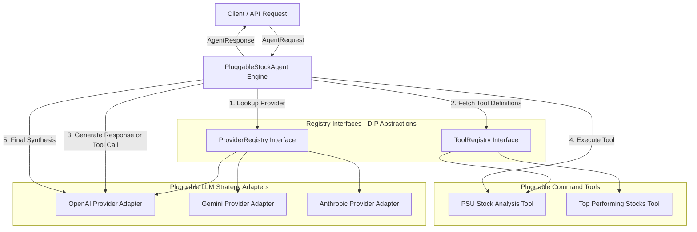
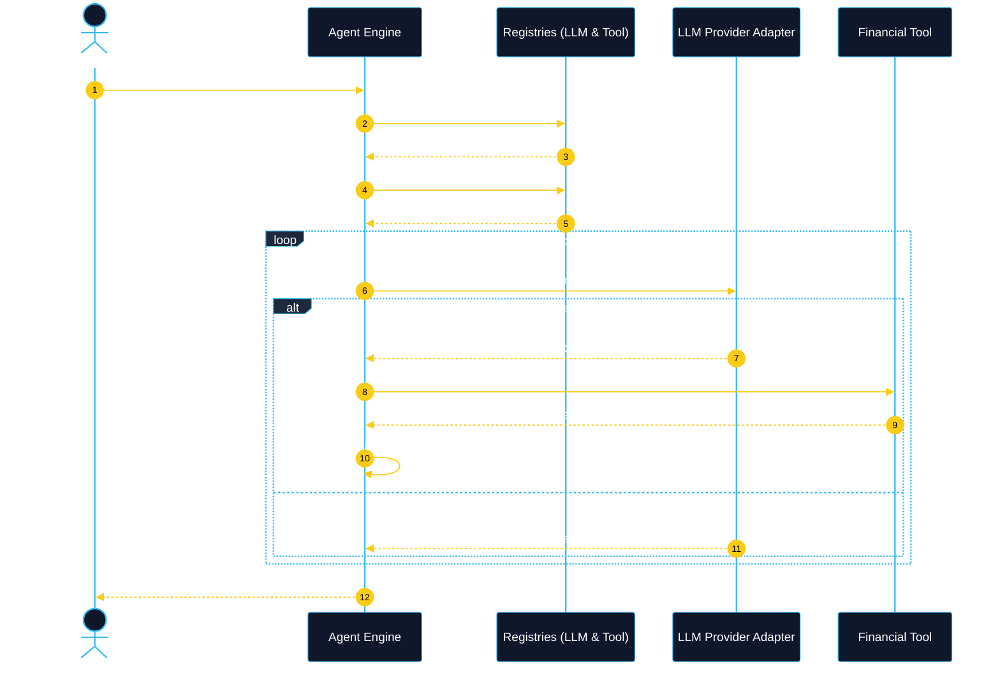

# Pluggable AI Agent Framework (Stock Market Domain)

A clean, production-ready Low-Level Design (LLD) implementation of a **Pluggable AI Agent Framework** built in **Golang**. 

This repository demonstrates how to design an agentic system that can process natural language queries for stock market analysis (e.g., PSU stock suggestions, top gainers, fundamental metrics) while seamlessly swapping underlying **LLM Providers** (OpenAI, Google Gemini, Anthropic Claude) and dynamically executing **Financial Tools**.

---

## 🛠️ Deep Dive: What is a "Tool" in Agentic AI Engineering?

### 1. The Core Concept
By default, Large Language Models (LLMs) are **pure text predictors and reasoning engines**. On their own, LLMs are isolated—they cannot browse the live web, query SQL databases, check stock tickers, send emails, or execute code.

In **Agentic Engineering**, a **Tool** is an external executable function, API, or database query exposed to the AI Agent that bridges the gap between **Reasoning (The LLM)** and **Action (The Real World)**.

```text
 ┌────────────────────────────────┐                 ┌──────────────────────────────┐
 │    Large Language Model (LLM)  │                 │    Real World / Environment  │
 │  • Excellent at Reasoning      │  cannot access  │ • Live Stock Exchange Data   │
 │  • Cannot execute code         │ ───────────────>│ • SQL Databases              │
 │  • Knowledge cutoff limits     │     directly    │ • Third-Party APIs           │
 └────────────────────────────────┘                 └──────────────────────────────┘
                                  ▲                 ▲
                                  │   via TOOLS     │
                                  └─────────────────┘
```

---

### 2. The Anatomy of a Tool
Every Tool in an agentic framework consists of three distinct parts:

1. **Schema Declaration (`ToolDefinition`)**:
   A JSON description telling the LLM what the tool is called, what it does, and what parameters it accepts.
   *Example*: `"get_psu_stocks_analysis": accepts sector (string)`.
2. **Tool Call Request (`ToolCall`)**:
   The LLM reads the user prompt, determines it needs real-time data, and emits a structured request: `"Run get_psu_stocks_analysis with arguments: sector='defence'"`.
3. **Execution Logic (`Execute`)**:
   The Agent runtime intercept the model's `ToolCall`, executes the underlying Go function/HTTP API, and returns the deterministic JSON output back to the LLM for synthesis.

---

### 3. The Medical Analogy

> Think of an LLM as a **brilliant doctor working without medical instruments**.
> - Without instruments, the doctor can only offer general advice based on memory.
> - **Tools** are the stethoscopes, X-ray machines, and blood tests given to the doctor.
> - The doctor *reasons* about what test is needed $\rightarrow$ asks the nurse (the **Agent Orchestrator**) to run the X-ray (**Tool Execution**) $\rightarrow$ receives the X-ray image (**Tool Result**) $\rightarrow$ provides a precise, accurate diagnosis (**Final Synthesized Answer**).

---

### 4. Why Tools are Essential in System Design (LLD)

| Benefit | Explanation | Design Pattern Applied |
| :--- | :--- | :--- |
| **Eliminates Hallucinations** | LLMs struggle with precise math or live data. Tools calculate math and fetch live data deterministically. | **Command Pattern** |
| **Security & Guardrails** | The Agent runtime controls tool permissions. The LLM only *requests* a tool; the Agent *verifies and executes* it. | **Proxy / Decorator Pattern** |
| **Pluggability (OCP)** | New capabilities (e.g. `StockNewsTool`, `OptionChainTool`) can be added by implementing the `Tool` interface without changing agent code. | **Open/Closed Principle** |

---

## 🧠 Component-by-Component Role Breakdown

If you are new to AI Agent architecture or System Design, here is a clear explanation of what **every component** in this framework does and why it exists:

---

### 1. Agent Engine (`pkg/agent/`)

| Component | Type | Plain English Analogy | Technical Role & Responsibility |
| :--- | :--- | :--- | :--- |
| **`Agent`** | `Interface` | **Job Description** | Defines the public API contract (`ExecuteQuery`). Any system consuming our agent relies on this interface. |
| **`PluggableStockAgent`** | `Struct` | **The Orchestra Conductor / Brain** | The core engine. It doesn't write stock reports itself or hardcode LLMs; instead, it coordinates asking the LLM, triggering financial tools if requested, and returning the final synthesized answer. |

---

### 2. LLM Providers Layer (`pkg/llm/`)

| Component | Type | Plain English Analogy | Technical Role & Responsibility |
| :--- | :--- | :--- | :--- |
| **`LLMProvider`** | `Interface` | **Universal AI Plug Socket** | The Strategy interface. Ensures every AI model (OpenAI, Gemini, Anthropic) exposes a uniform function: `GenerateResponse(ctx, req)`. |
| **`ProviderRegistry`** | `Interface` | **AI Catalog / Phonebook Contract** | Defines how the Agent can look up AI providers dynamically by string name (`"openai"`, `"gemini"`). |
| **`DefaultLLMRegistry`** | `Struct` | **AI Catalog Implementation** | A thread-safe, mutex-protected `map[string]LLMProvider` that stores active model provider instances. |
| **`OpenAIProvider`** | `Struct / Adapter` | **OpenAI Translator** | Translates standard framework requests (`LLMRequest`) into OpenAI's format, calls OpenAI, and adapts the response back into standard `LLMResponse`. |
| **`GeminiProvider`** | `Struct / Adapter` | **Google Gemini Translator** | Translates standard framework requests into Google Gemini's format and handles Gemini-specific tool calls. |
| **`AnthropicProvider`** | `Struct / Adapter` | **Claude Translator** | Translates standard framework requests into Anthropic Claude's format and handles Claude-specific tool calls. |

---

### 3. Financial Tools Layer (`pkg/tools/`)

| Component | Type | Plain English Analogy | Technical Role & Responsibility |
| :--- | :--- | :--- | :--- |
| **`Tool`** | `Interface` | **Universal Tool Contract** | The Command interface. Ensures every tool provides its schema descriptor (`Definition()`) and executable function (`Execute()`). |
| **`ToolRegistry`** | `Interface` | **Toolbox Catalog Contract** | Defines how the Agent discovers available tools to pass their schemas to the LLM. |
| **`DefaultToolRegistry`** | `Struct` | **Toolbox Catalog Implementation** | A thread-safe `map[string]Tool` holding registered financial tools. |
| **`PSUSuggestionTool`** | `Struct / Command` | **PSU Stock Specialist** | A tool that fetches fundamental analysis, order book data, and dividend yields for Indian PSU stocks (NTPC, HAL, SBIN, BEL). |
| **`TopPerformingStocksTool`** | `Struct / Command` | **Market Momentum Scanner** | A tool that fetches technical indicators (RSI, price breakouts, YTD returns) for top market performers. |

---

### 4. Data Contracts & Domain Models (`pkg/models/`)

| Model Struct | Plain English Analogy | Purpose in Code |
| :--- | :--- | :--- |
| **`Message`** | **Single Chat Turn** | Represents a message sent by System, User, Assistant, or Tool. |
| **`ToolDefinition`** | **Tool Instruction Manual** | Tells the LLM what a tool is named, what it does, and what parameters it accepts. |
| **`ToolCall`** | **LLM Request to Run a Tool** | Generated by the LLM when it decides: *"I need to run `get_psu_stocks_analysis` with sector='defence'"*. |
| **`ToolResult`** | **Tool Execution Output** | Raw JSON string output produced by running a tool, sent back to the LLM for synthesis. |
| **`AgentRequest`** | **User Query Input** | The user's input containing query string, requested provider name (`"openai"`), and model (`"gpt-4o"`). |
| **`AgentResponse`** | **Final Deliverable** | The final answer returned to the user, complete with execution latency and tools invoked. |

---

## 📐 2. System Requirements & Scope

### Functional Requirements
1. **Natural Language Query Execution**: Process complex user queries regarding equity markets, sector performance, and PSU (Public Sector Undertaking) stock recommendations.
2. **Pluggable Model Providers**: Dynamically switch between model providers (`openai`, `gemini`, `anthropic`, `deepseek`) at runtime without changing the core agent orchestration logic.
3. **Pluggable Financial Tools**: Equip the agent with dynamic tool execution capabilities (e.g., PSU stock analyzer, market top performer analyzer).
4. **Structured Agent Response**: Return the synthesized answer alongside execution metadata (provider used, model name, tools executed, latency).

### Non-Functional Requirements
1. **Dependency Inversion Principle (DIP / SOLID)**: All high-level modules (`PluggableStockAgent`) depend on interface abstractions (`ProviderRegistry`, `ToolRegistry`, `LLMProvider`, `Tool`), not on concrete struct pointers.
2. **Extensibility (Open/Closed Principle)**: Easily plug in new LLMs or financial data APIs by satisfying Go interfaces without editing existing core packages.
3. **Testability & Decoupling**: High-level agent logic depends strictly on interface abstractions, enabling 100% mockability in unit tests.
4. **Thread Safety**: Concurrent requests using different providers or tool sets are safe via mutex-protected registries.
5. **Bound Execution**: Cap the ReAct (Reasoning + Action) iteration loop to prevent infinite tool calling.

---

## 🏗️ 3. Architecture & Design Diagrams

### High-Level Component Diagram



---

### Sequence Diagram: Agent ReAct Execution Loop



---

## 🎨 4. Design Patterns Applied

| Pattern | Location | Purpose |
| :--- | :--- | :--- |
| **Dependency Inversion (DIP)** | `pkg/agent/agent.go` | `PluggableStockAgent` depends on `llm.ProviderRegistry` and `tools.ToolRegistry` interfaces, not concrete struct pointers. |
| **Strategy Pattern** | `pkg/llm/llm.go` | `LLMProvider` interface enables runtime swapping of model providers without modifying the agent. |
| **Adapter Pattern** | `pkg/llm/llm.go` | `OpenAIProvider`, `GeminiProvider`, and `AnthropicProvider` adapt vendor SDKs to a standardized `GenerateResponse` contract. |
| **Command Pattern** | `pkg/tools/tool.go` | `Tool` interface encapsulates tool metadata (`Definition()`) and execution logic (`Execute()`). |
| **Registry Pattern** | `pkg/llm/llm.go` & `pkg/tools/tool.go` | `ProviderRegistry` and `ToolRegistry` interfaces manage dynamic registration, thread-safe lookup, and dependency injection. |
| **ReAct Loop Orchestrator** | `pkg/agent/agent.go` | `PluggableStockAgent` manages the iterative **Reasoning $\rightarrow$ Tool Action $\rightarrow$ Synthesis** cycle. |

---

## 📁 5. Project Directory Structure

```text
plugable_agentic_framework/
├── README.md                 # System Design & Study Guide documentation
├── go.mod                    # Go Module definition
├── main.go                   # Demo entrypoint executing provider swapping
└── pkg/
    ├── agent/
    │   └── agent.go          # Pluggable Agent engine depending on ProviderRegistry & ToolRegistry interfaces
    ├── llm/
    │   └── llm.go            # LLMProvider & ProviderRegistry interfaces, DefaultLLMRegistry, & Adapters
    ├── models/
    │   └── models.go         # Domain models (Messages, Tool Calls, Requests, Responses)
    └── tools/
        └── tool.go           # Tool & ToolRegistry interfaces, DefaultToolRegistry, & Financial Tools
```

---

## 💻 6. Code Walkthrough & Key Interfaces

### 1. Provider Registry Abstraction ([pkg/llm/llm.go](file:///Users/anunay/Developer/go_coding/plugable_agentic_framework/pkg/llm/llm.go))
```go
type LLMProvider interface {
    Name() string
    GenerateResponse(ctx context.Context, req models.LLMRequest) (*models.LLMResponse, error)
}

type ProviderRegistry interface {
    Register(provider LLMProvider)
    Get(name string) (LLMProvider, error)
    ListProviders() []string
}
```

### 2. Tool Registry Abstraction ([pkg/tools/tool.go](file:///Users/anunay/Developer/go_coding/plugable_agentic_framework/pkg/tools/tool.go))
```go
type Tool interface {
    Definition() models.ToolDefinition
    Execute(ctx context.Context, args map[string]interface{}) (string, error)
}

type ToolRegistry interface {
    Register(t Tool)
    Get(name string) (Tool, bool)
    Definitions() []models.ToolDefinition
}
```

### 3. Agent Injected via Interfaces ([pkg/agent/agent.go](file:///Users/anunay/Developer/go_coding/plugable_agentic_framework/pkg/agent/agent.go))
```go
type PluggableStockAgent struct {
    providerRegistry llm.ProviderRegistry // Interface dependency
    toolRegistry     tools.ToolRegistry    // Interface dependency
    systemPrompt     string
}

func NewPluggableStockAgent(providerReg llm.ProviderRegistry, toolReg tools.ToolRegistry) *PluggableStockAgent {
    return &PluggableStockAgent{
        providerRegistry: providerReg,
        toolRegistry:     toolReg,
        systemPrompt:     "You are an expert AI Stock Market Assistant...",
    }
}
```

---

## 🚀 7. How to Run & Test

Execute the demo application:

```bash
go run main.go
```

---

## 🛠️ 8. Extensibility Guide: How to Extend

### How to Add a New LLM Provider (e.g. DeepSeek / Ollama)?

1. Create a new provider struct in `pkg/llm/` implementing `LLMProvider`:
   ```go
   type DeepSeekProvider struct { APIKey string }

   func (p *DeepSeekProvider) Name() string { return "deepseek" }

   func (p *DeepSeekProvider) GenerateResponse(ctx context.Context, req models.LLMRequest) (*models.LLMResponse, error) {
       // Adapt DeepSeek API format to models.LLMResponse
   }
   ```
2. Register it in `main.go`:
   ```go
   llmRegistry.Register(llm.NewDeepSeekProvider("your-api-key"))
   ```

---

## 🎓 9. System Design Interview Study Guide & Cheat Sheet

### Common Interview Follow-up Questions & How to Answer

#### Q1: Why depend on `ProviderRegistry` and `ToolRegistry` interfaces instead of concrete structs?
> **Answer**: This strictly follows the **Dependency Inversion Principle (DIP)**. It decouples the core `PluggableStockAgent` orchestrator from any specific registry implementation (e.g. in-memory map vs Redis/Distributed Registry) and allows 100% isolated unit testing via mocks without spinning up real registries or network calls.

#### Q2: How do you handle Rate Limits or Provider Failures?
> **Answer**: Implement a **Fallback Strategy** / **Circuit Breaker** inside a decorating `ProviderRegistry`. If the primary provider (`openai`) returns a 429 (Rate Limit) or 5xx error, the registry automatically retries with a secondary provider (`gemini` or `anthropic`).

#### Q3: How do you handle Parallel Tool Execution?
> **Answer**: When an LLM requests multiple tool calls simultaneously in `resp.ToolCalls`, use Go goroutines and `sync.WaitGroup` / `golang.org/x/sync/errgroup` to execute all tools concurrently, cutting total latency down from $O(N)$ to $O(1)$.
