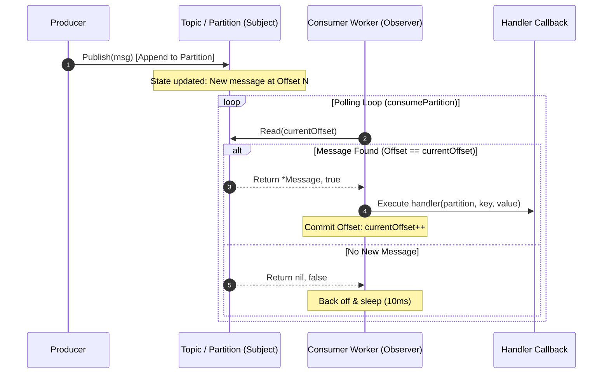

# Kafka-like Pub-Sub System LLD in Golang

This project implements a Low-Level Design (LLD) of a distributed Publish-Subscribe messaging system similar to Apache Kafka, written in Golang. 

## 1. Functional Requirements

*   **Topics:** The system must allow the creation of topics, which represent logical streams of data.
*   **Partitions:** Topics must be divided into partitions to allow for scalability and parallel processing. Partitions maintain a strict ordering of messages.
*   **Producers:** Applications must be able to publish messages to a specific topic.
*   **Message Routing (Partitioning):**
    *   If a message has a key, all messages with the same key must be routed to the same partition (Hash-based partitioning) to guarantee ordering for that key.
    *   If a message has no key, the system should distribute it (e.g., via Round-Robin or Timestamp-based routing) across available partitions for load balancing.
*   **Consumers and Consumer Groups:**
    *   Consumers should be able to subscribe to a topic and read messages.
    *   Consumers should be organized into Consumer Groups.
    *   Each partition in a topic must be assigned to exactly one consumer within a Consumer Group. (This prevents duplicate processing within the group and ensures ordered consumption per partition).
*   **Offset Management:** The system must keep track of the offsets (the position of the message in a partition) that a consumer group has successfully processed, allowing consumers to resume from where they left off in case of failures.

## 2. Non-Functional Requirements

*   **Scalability:** The system should be able to handle an increasing volume of messages by adding more partitions to a topic and more consumers to a group.
*   **High Throughput:** The design should support high message ingestion and consumption rates (achieved via concurrent processing on partitions).
*   **Availability/Fault Tolerance:** (In this LLD, simulated via concurrent access safety) The system should allow multiple concurrent reads and writes without corrupting the state. In a full system, this implies data replication across multiple brokers.
*   **Durability:** Messages appended to a partition should be persistent. (In this in-memory LLD, it's simulated by retaining messages in memory slices; a real system would write to disk).
*   **Concurrency:** The system must be thread-safe. Multiple producers and consumers will be accessing the broker, topics, and partitions simultaneously.

## 3. SOLID Principles & Architecture

The architecture relies heavily on interfaces defined in `core/interfaces.go` to enforce SOLID principles, specifically **Dependency Inversion** and **Open/Closed**:

### Dependency Inversion Principle (DIP)
*   High-level modules (Clients, Producers, ConsumerGroups) **do not depend on concrete implementations** of the Broker, Topic, or Partition.
*   Instead, they depend on abstractions (`core.Broker`, `core.Topic`, `core.Partition`). 
*   This makes the system highly testable (e.g., we can easily inject a mock Broker into the Producer for unit testing).

### Open/Closed Principle (OCP)
*   The `core.Partitioner` interface allows you to define new routing strategies (e.g., `RoundRobinPartitioner`, `ConsistentHashPartitioner`) without ever modifying the `broker.DefaultTopic` code. You simply inject a different `Partitioner` into the topic.
*   The `core.Partition` interface allows extending the system with a `DiskPartition` instead of a `MemoryPartition` without changing how Topics or Consumers interact with it.

## 4. Core Components & Interface Definitions

The system is built on decoupled interfaces defined in [`core/interfaces.go`](file:///Users/anunay/Developer/go_coding/pub-sub/core/interfaces.go) and domain models in [`models/message.go`](file:///Users/anunay/Developer/go_coding/pub-sub/models/message.go):

### Message Model
```go
type Message struct {
	Key       []byte
	Value     []byte
	Offset    uint64
	Timestamp time.Time
}
```

### Interfaces
```go
// Broker represents the central pub-sub system registry.
type Broker interface {
	CreateTopic(name string, numPartitions int) error
	GetTopic(name string) (Topic, error)
}

// Topic represents a logical stream of messages.
type Topic interface {
	Publish(msg *models.Message) (int, uint64, error)
	GetPartition(index int) Partition
	PartitionsCount() int
}

// Partition represents an ordered, immutable sequence of messages.
type Partition interface {
	Append(msg *models.Message) uint64
	Read(offset uint64) (*models.Message, bool)
	GetMaxOffset() uint64
}

// Partitioner defines the strategy for assigning messages to partitions.
type Partitioner interface {
	Partition(msg *models.Message, numPartitions int) int
}
```

---

## 5. Key Function Logic Excerpts

### 5.1. Partitioning Strategy (`broker/partitioner.go`)
Decides the target partition using hash-based routing for keyed messages (guaranteeing ordering) and timestamp modulo for keyless messages:
```go
func (dp *DefaultPartitioner) Partition(msg *models.Message, numPartitions int) int {
	if numPartitions == 0 {
		return 0
	}
	// Keyed: Hash-based routing to preserve ordering per key
	if len(msg.Key) > 0 {
		h := fnv.New32a()
		h.Write(msg.Key)
		return int(h.Sum32() % uint32(numPartitions))
	}
	// Keyless fallback: Round/Timestamp distribution
	return int(msg.Timestamp.UnixNano() % int64(numPartitions))
}
```

### 5.2. Partition Append & Read (`broker/partition.go`)
Thread-safe message storage with monotonic offset increment and zero-copy read:
```go
// Append adds a new message and increments offset with write-lock
func (p *MemoryPartition) Append(msg *models.Message) uint64 {
	p.mu.Lock()
	defer p.mu.Unlock()

	msg.Offset = p.offset
	p.messages = append(p.messages, *msg)
	currentOffset := p.offset
	p.offset++
	return currentOffset
}

// Read retrieves a message by offset with read-lock
func (p *MemoryPartition) Read(offset uint64) (*models.Message, bool) {
	p.mu.RLock()
	defer p.mu.RUnlock()

	if offset >= uint64(len(p.messages)) {
		return nil, false
	}
	msg := p.messages[offset]
	return &msg, true
}
```

### 5.3. Topic Publish Delegation (`broker/topic.go`)
Delegates partition selection to the injected `Partitioner` strategy:
```go
func (t *DefaultTopic) Publish(msg *models.Message) (int, uint64, error) {
	t.mu.RLock()
	defer t.mu.RUnlock()

	numPart := len(t.Partitions)
	if numPart == 0 {
		return 0, 0, fmt.Errorf("no partitions available in topic")
	}

	partitionIndex := t.partitioner.Partition(msg, numPart)
	part := t.Partitions[partitionIndex]
	offset := part.Append(msg)
	
	return partitionIndex, offset, nil
}
```

### 5.4. Consumer Group Subscription & Polling (`client/consumer_group.go`)
Spawns dedicated Goroutines per partition and commits offsets upon handler execution:
```go
func (cg *ConsumerGroup) Subscribe(ctx context.Context, topicName string, handler func(partition int, key []byte, value []byte)) error {
	topic, err := cg.broker.GetTopic(topicName)
	if err != nil {
		return err
	}
	// ... Initialize topic offsets map ...
	for i := 0; i < topic.PartitionsCount(); i++ {
		go cg.consumePartition(ctx, topicName, i, topic.GetPartition(i), handler)
	}
	return nil
}

func (cg *ConsumerGroup) consumePartition(ctx context.Context, topicName string, partIdx int, partition core.Partition, handler func(partition int, key []byte, value []byte)) {
	cg.mu.RLock()
	currentOffset := cg.offsets[topicName][partIdx]
	cg.mu.RUnlock()

	for {
		select {
		case <-ctx.Done():
			return
		default:
			msg, found := partition.Read(currentOffset)
			if found {
				handler(partIdx, msg.Key, msg.Value)
				currentOffset++
				
				// Commit offset
				cg.mu.Lock()
				cg.offsets[topicName][partIdx] = currentOffset
				cg.mu.Unlock()
			} else {
				time.Sleep(10 * time.Millisecond) // Back off before next poll
			}
		}
	}
}
```

---

## 6. Design Patterns Used

### 6.1. Strategy Pattern (Partitioning Strategy)
* **Where:** `core.Partitioner` and `DefaultTopic.Publish()`
* **Why:** We need different algorithms to decide which partition a message goes to, and we want to change them dynamically or extend them without modifying the Topic class (OCP).

### 6.2. Singleton Pattern
* **Where:** `broker.GetBroker()`
* **Why:** The broker acts as the central coordinator. We only want one instance of the Broker to manage the state of all topics and partitions to avoid inconsistencies.

### 6.3. Observer Pattern (Pub-Sub Variant)

The Publish-Subscribe architecture in this project is an evolution of the classic **Gang of Four (GoF) Observer Pattern**, tailored for distributed message brokers like Apache Kafka.

#### Mapping to Observer Pattern Concepts

| GoF Observer Concept | Pub-Sub / System Equivalent | Description |
| :--- | :--- | :--- |
| **Subject (Observable)** | `core.Topic` / `core.Partition` | Maintains the state (immutable stream of `models.Message`s). It doesn't need direct knowledge of concrete consumer identities. |
| **Observer (Subscriber)** | `client.ConsumerGroup` & Worker Goroutines | Entities interested in state changes (new messages) published to a specific topic. |
| **Registration (`Attach`)** | `ConsumerGroup.Subscribe(ctx, topic, handler)` | Registers interest in a topic and attaches an event handler callback function `func(partition int, key, value []byte)`. |
| **Update Notification** | `partition.Read(offset)` + `handler(...)` | Detection and dispatch of new messages to the observer's handler callback. |

#### Pull-Based vs. Push-Based Observer Model



#### Key Characteristics of This Observer Implementation:

1. **Pull-Based (Poll-Driven) Observation:**
   * In a traditional GoF Observer, the Subject actively *pushes* updates by iterating through a list of observers and synchronously invoking `observer.Update()`.
   * In this distributed design, consumers use a **pull model**: each consumer worker runs a continuous loop polling `partition.Read(currentOffset)`. This prevents fast producers from overwhelming slow observers (backpressure control) and allows observers to process at their own rate.

2. **Decoupled 1-to-Many Event Distribution:**
   * Multiple independent `ConsumerGroup` instances can observe the same `Topic`.
   * Each consumer group tracks its own `offsets` map independently without mutating the underlying partition or affecting other observers.

3. **Event Handler / Callback Dispatch:**
   * When an observer worker detects a new message at its current offset, it notifies the client application by invoking the registered callback `handler(partIdx, msg.Key, msg.Value)`.

4. **Partition-Level Concurrent Observers:**
   * During `Subscribe()`, the `ConsumerGroup` launches a dedicated Goroutine per partition (`consumePartition`).
   * This provides thread-safe, non-blocking parallel observation across different partitions while preserving strict sequential observation per partition.

### 6.4. Concurrency Patterns (Worker Pool / Goroutines)
* **Where:** `ConsumerGroup.Subscribe()`
* **Why:** To achieve high throughput, partitions must be processed in parallel.
* **Implementation:** The Consumer Group launches a distinct Goroutine (worker) for each partition it is assigned to, coupled with `sync.RWMutex` for memory safety.

---

## 7. How to Run

1. Make sure you have Go installed.
2. Clone/navigate to the directory.
3. Run the demonstration:
   ```bash
   go run main.go
   ```
