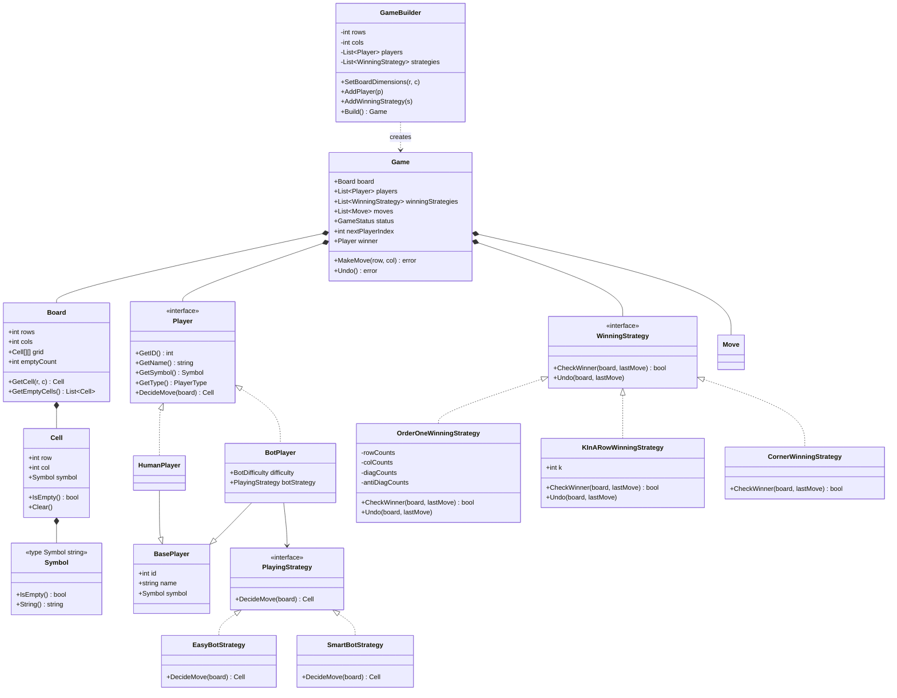

# Tic-Tac-Toe Low-Level Design (LLD) in Go

A clean, production-ready, object-oriented Low-Level Design (LLD) for **Tic-Tac-Toe** implemented in **Go**. This project demonstrates scalable architectural patterns, SOLID design principles, and comprehensive answers to common low-level system design interview follow-ups.

---

## 🎯 System Requirements

### 📋 Functional Requirements (FR)

1. **Board Initialization**:
   - Support dynamic grid dimensions ($N \times M$), defaulting to $3 \times 3$ for standard gameplay.
2. **Player Management**:
   - Support $N$ players ($2, 3, 4+$) in a single game instance.
   - Assign each player a unique symbol (`X`, `O`, `#`, `$`, `❌`, `⭕`, etc.) and unique player ID.
   - Support both **Human** players and **AI Bot** players via polymorphism.
3. **Move Execution & Validation**:
   - Players make moves sequentially in a round-robin turn order.
   - Validate move boundaries ($0 \le \text{row} < N$, $0 \le \text{col} < M$) and reject moves on occupied cells.
4. **Dynamic Win Condition Evaluation**:
   - Check victory conditions after every move based on injected rule strategies.
   - Declare winner immediately when a player satisfies any winning rule.
5. **Draw Handling**:
   - Automatically detect game DRAW when the board has no empty cells and no player has won.
6. **Move History & Undo**:
   - Maintain a stack of all historical moves (`Moves []Move`).
   - Allow undoing the last move (`Undo()`), restoring the board cell, player turn, and win evaluation counters.
7. **AI Bot Strategy Execution**:
   - AI Bot players automatically decide moves based on configured strategies (`EasyBotStrategy`, `SmartBotStrategy`, etc.).

---

### 🚀 Non-Functional Requirements (NFR)

1. **Extensibility & Modularity (SOLID / Open-Closed Principle)**:
   - Adding a new win condition (e.g. 4-Corner Win, $K$-in-a-row) or AI Bot difficulty requires zero modifications to core `Game` or `Board` logic.
2. **Performance & Low Latency**:
   - Win evaluation for $N \times N$ standard board executes in **$\mathcal{O}(1)$ time** per move using counter arrays.
   - Win evaluation for big boards ($100 \times 100$) with $K$-in-a-row rule executes in **$\mathcal{O}(K)$ directional time** per move instead of full $\mathcal{O}(N^2)$ board scans.
3. **Maintainability & Clean Separation of Concerns (SRP)**:
   - Decoupled packages (`models`, `strategies/winning`, `strategies/playing`, `game`).
4. **Robust Validation & Error Handling**:
   - `GameBuilder` enforces strict runtime invariants before game creation (min 2 players, unique symbols, non-empty strategies).
5. **Concurrency & Server-Ready Design**:
   - Stateless strategy implementations capable of handling multi-threaded game instances cleanly.

---

## 🎨 Design Patterns Used

This Tic-Tac-Toe design extensively leverages software design patterns to ensure extensibility, maintainability, and clean separation of concerns:

| Design Pattern | Pattern Category | Where It Is Used | Purpose & Key Advantage |
| :--- | :--- | :--- | :--- |
| **Strategy Pattern** | Behavioral | `WinningStrategy` interface (`OrderOneWinningStrategy`, `KInARowWinningStrategy`, `CornerWinningStrategy`) | Decouples game victory rules from the game engine. Rules can change or be combined dynamically without modifying `Game` or `Board`. |
| **Strategy Pattern** | Behavioral | `PlayingStrategy` interface (`EasyBotStrategy`, `SmartBotStrategy`) | Encapsulates AI Bot decision algorithms. Allows adding new AI difficulties (e.g. Minimax, Heuristic) without modifying `Player` or `Game`. |
| **Interface Polymorphism** | Structural | `Player` interface (`HumanPlayer`, `BotPlayer`) | Avoids "God Object" anti-pattern. Ensures `HumanPlayer` carries zero bot overhead while `BotPlayer` encapsulates bot difficulty and AI strategy. |
| **Domain Type Wrapping** | Structural / Modeling | `type Symbol string` | Prevents primitive obsession while remaining lightweight and supporting Emojis (`❌`, `⭕`). |
| **Builder Pattern** | Creational | `GameBuilder` | Solves complex object creation by enforcing validation rules (e.g., minimum 2 players, unique player symbols, valid board size, required winning strategies) before instantiating `Game`. |
| **State Pattern / State Tracking** | Behavioral | `GameStatus` (`IN_PROGRESS`, `ENDED`, `DRAW`) | Manages game lifecycle states and prevents illegal moves when a game has concluded. |
| **Command / History Pattern** | Behavioral | `Moves []Move` & `Game.Undo()` | Encapsulates played moves into discrete data objects stored in a historical stack, enabling step-by-step move undoing and rule state restoration. |

---

## 🏗 System Architecture & Class Diagram



---

## 📌 Features & Capabilities

- **Dynamic $N \times M$ Board**: Supports standard $3 \times 3$ boards as well as large boards (e.g. $10 \times 10$, $100 \times 100$).
- **$N$-Player Support**: Scalable to multi-player games ($2, 3, 4+$ players) with unique symbols (`X`, `O`, `#`, `$`, `❌`, `⭕`, etc.).
- **Extensible Winning Strategies (Strategy Pattern)**:
  - $\mathcal{O}(1)$ Standard Full-Row / Full-Column / Diagonal win detection.
  - $\mathcal{O}(K)$ $K$-in-a-Row win detection for big boards (Gomoku style).
  - Custom rules (e.g., 4-Corner capture rule).
- **AI / Bot Players (Strategy Pattern)**:
  - Flexible bot difficulties (`EasyBotStrategy`, `SmartBotStrategy`, etc.).
  - Bot vs Human, Bot vs Bot, and Multi-Bot player support.
- **Robust Construction (Builder Pattern)**: `GameBuilder` enforces runtime validation (duplicate symbol detection, player count limits, strategy requirement).
- **Move History & Undo (Command Pattern)**: Stack-based move tracking allowing seamless `Undo()` operations.

---

## 📁 Repository Structure

```
.
├── README.md                      # Project documentation
├── go.mod                         # Go module declaration
├── main.go                        # Demonstration entry point
└── pkg/
    ├── game/
    │   ├── game.go                # Game engine & GameBuilder implementation
    │   ├── game_status.go         # Game status enumeration
    │   └── game_test.go           # Unit tests (validation, gameplay, undo, big board)
    ├── models/
    │   ├── board.go               # Board matrix & operations
    │   ├── cell.go                # Grid square state
    │   ├── move.go                # Recorded move record
    │   ├── player.go              # HumanPlayer and BotPlayer abstractions
    │   └── symbol.go              # Symbol domain type (`type Symbol string`)
    └── strategies/
        ├── playing/
        │   ├── playing_strategy.go  # Bot playing strategy interface
        │   ├── easy_bot_strategy.go # Random bot strategy
        │   └── smart_bot_strategy.go# Strategic bot strategy
        └── winning/
            ├── winning_strategy.go         # Win strategy interface
            ├── order_one_winning_strategy.go# O(1) row/col/diag count strategy
            ├── k_in_a_row_winning_strategy.go# O(K) directional search for big boards
            └── corner_winning_strategy.go   # Custom rule (4 corner capture)
```

---

## ⚡ Deep-Dive: How `OrderOneWinningStrategy` Works ($\mathcal{O}(1)$ Win Detection)

The [`OrderOneWinningStrategy`](file:///Users/anunay/Developer/go_coding/tic-tac-toe/pkg/strategies/winning/order_one_winning_strategy.go) optimizes victory verification from a naive $\mathcal{O}(N)$ loop per turn down to **$\mathcal{O}(1)$ constant time**.

### 🐢 Naive Approach vs ⚡ $\mathcal{O}(1)$ Strategy

- **Naive Approach ($\mathcal{O}(N)$ per move)**: Iterates over all $N$ cells in row $r$, column $c$, main diagonal, and anti-diagonal after every turn.
- **Optimized Strategy ($\mathcal{O}(1)$ per move)**: Maintains running frequency counter maps that track symbol counts in real-time as moves are played:

```go
type OrderOneWinningStrategy struct {
    rowCounts      []map[models.Symbol]int // rowCounts[r][symbol] = count of symbol in row r
    colCounts      []map[models.Symbol]int // colCounts[c][symbol] = count of symbol in col c
    diagCounts     map[models.Symbol]int   // diagCounts[symbol]   = count of symbol on Main Diagonal (\)
    antiDiagCounts map[models.Symbol]int   // antiDiagCounts[symbol] = count of symbol on Anti-Diagonal (/)
}
```

### 📐 Grid Coordinate & Diagonal Mathematics

```
                  Col 0    Col 1    Col 2
               +--------+--------+--------+
  Row 0 (r=0)  | (0,0)\ | (0,1)  | (0,2)/ |
               +--------+--------+--------+
  Row 1 (r=1)  | (1,0)  | (1,1)\/| (1,2)  |
               +--------+--------+--------+
  Row 2 (r=2)  | (2,0)/ | (2,1)  | (2,2)\ |
               +--------+--------+--------+

  Main Diagonal (\) : row == col               (e.g., (0,0), (1,1), (2,2))
  Anti-Diagonal (/) : row + col == N - 1       (e.g., (0,2), (1,1), (2,0))
```

### 🔄 Algorithm Execution Step-by-Step

When player $P$ plays `symbol` at position $(r, c)$ on an $N \times N$ board:

1. **Row Count Update**: Increment `rowCounts[r][symbol]`. If `rowCounts[r][symbol] == N`, player $P$ fills row $r$ and **WINS!**
2. **Column Count Update**: Increment `colCounts[c][symbol]`. If `colCounts[c][symbol] == N`, player $P$ fills column $c$ and **WINS!**
3. **Main Diagonal Check ($r == c$)**: Increment `diagCounts[symbol]`. If `diagCounts[symbol] == N`, player $P$ fills main diagonal and **WINS!**
4. **Anti-Diagonal Check ($r + c == N - 1$)**: Increment `antiDiagCounts[symbol]`. If `antiDiagCounts[symbol] == N`, player $P$ fills anti-diagonal and **WINS!**

### ↩ Constant-Time Undo ($\mathcal{O}(1)$)

When reversing a move via `Game.Undo()`, counters are decremented in $\mathcal{O}(1)$ time without scanning the board:

```go
func (s *OrderOneWinningStrategy) Undo(board *models.Board, lastMove models.Move) {
    row := lastMove.Cell.Row
    col := lastMove.Cell.Col
    symbol := lastMove.Player.GetSymbol()

    s.rowCounts[row][symbol]--
    s.colCounts[col][symbol]--

    if row == col {
        s.diagCounts[symbol]--
    }
    if row+col == board.Rows-1 {
        s.antiDiagCounts[symbol]--
    }
}
```

---

## 🧐 Architectural Trade-off Analysis

### 1. Symbol Design (`type Symbol string` vs `rune` vs `struct`)

| Symbol Representation | Memory & Performance | Unicode / Emoji Support | Multi-Character Symbol Support | Verdict |
| :--- | :--- | :--- | :--- | :--- |
| **`rune` (int32)** | $\mathcal{O}(1)$ (4 bytes) | Single Unicode char | ❌ No (`"P1"` invalid) | Too restrictive if players want multi-char or complex emojis. |
| **`string`** | Lightweight pointer | Full Emoji / Unicode | ✅ Yes (`"P1"`, `"Player1"`) | Flexible, but risks Primitive Obsession if un-wrapped. |
| **`type Symbol string` (Domain Type)** *(Chosen)* | Lightweight & Type-Safe | Full Emoji / Unicode (`"❌"`, `"⭕"`) | ✅ Yes | **Best Go Idiomatic Choice**: Prevents primitive mixing, zero struct overhead, supports emojis & custom symbols. |

- **When `struct Symbol` IS needed**: When a Symbol has visual metadata (`Color`, `IconURL`, `Metadata`).
- **When `type Symbol string` IS preferred**: For CLI / Core Engine LLD, `type Symbol string` avoids over-engineering (YAGNI).

---

### 2. Player Polymorphism (`HumanPlayer` & `BotPlayer` interface vs single struct)

#### ❌ Problem with Single `Player` Concrete Struct:
If a single `Player` struct contains `BotDifficulty` and `BotStrategy`:
1. **Single Responsibility Principle (SRP) Violation**: A `HumanPlayer` is forced to carry fields (`BotDifficulty`, `BotStrategy`) that are completely irrelevant for human players.
2. **Nullability & Field Bloat**: `HumanPlayer` objects carry unused `nil` pointers.

#### ✅ Recommended LLD Solution: Interface Polymorphism

```go
type Player interface {
    GetID() int
    GetName() string
    GetSymbol() Symbol
    GetType() PlayerType
    DecideMove(board *Board) (*Cell, error)
}

type HumanPlayer struct {
    BasePlayer
}

type BotPlayer struct {
    BasePlayer
    Difficulty  BotDifficulty
    BotStrategy PlayingStrategy
}
```

---

## ❓ Interview Follow-Up Solutions & Pattern Mapping

### 1. What if the rules of Tic-Tac-Toe change?
* **Design Pattern**: **Strategy Pattern** via `WinningStrategy`
* Win logic is completely decoupled from `Game` and `Board`.
* Adding new rules (e.g. 4-Corner win, $K$-in-a-row win, or Misère / upside-down tic-tac-toe) only requires creating a new struct implementing `WinningStrategy`.

### 2. What if you want an AI / Bot player?
* **Design Pattern**: **Strategy Pattern** via `PlayingStrategy` + **Polymorphic `Player` Interface**
* The `BotPlayer` struct encapsulates bot strategy without leaking fields into `HumanPlayer`.
* New AI strategies (Random, Center-first, Minimax with Alpha-Beta Pruning, Monte Carlo Tree Search) can be added without modifying `HumanPlayer`, `BotPlayer`, or `Game` loop.

### 3. What if you want to support Multi-Player on a Big Board?
* **Design Pattern**: **Dynamic State + $\mathcal{O}(K)$ Directional Strategy**
* **Grid**: Board dimensions ($N \times M$) and win target ($K$) are configurable.
* **Turn Order**: Multi-player round-robin loop (`nextPlayerIndex = (nextPlayerIndex + 1) % totalPlayers`).
* **Performance**: Full board scanning on large grids ($100 \times 100$) is $\mathcal{O}(N^2)$. The included `KInARowWinningStrategy` checks only 4 axes radiating up to $K-1$ cells from `lastMove`, running in **$\mathcal{O}(K)$ time**.

---

## 🚀 How to Run

### Run Demonstration
Execute `main.go` to see 3 automated scenarios (Human vs Smart Bot, 10x10 3-Player 5-in-a-row, and 4-Corner Win rule):

```bash
go run main.go
```

### Run Unit Tests
Run unit tests across all packages:

```bash
go test -v ./...
```
