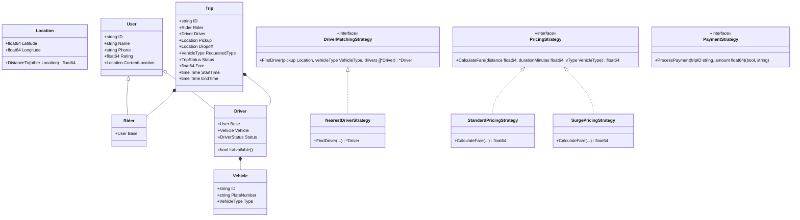

# Uber Low-Level Design (LLD) in Go 🚗💨

A clean, production-ready, extensible Low-Level Design (LLD) implementation of an **Uber-like Ride Hailing System** in **Go (Golang)**. This project demonstrates core Object-Oriented Design Principles (SOLID), Software Design Patterns, Thread-Safety, and Idiomatic Go project structure using `internal/` packages.

---

## 🌟 Key Features

1. **User Management**:
   - Register **Riders** and **Drivers**.
   - Track driver availability (`OFFLINE`, `AVAILABLE`, `ON_TRIP`).
   - Track locations (`Latitude`, `Longitude`) for riders and drivers.

2. **Vehicle Management**:
   - Support multiple vehicle categories: `BIKE`, `AUTO`, `SEDAN`, `SUV`.

3. **Pluggable Driver Matching (Strategy Pattern)**:
   - Match riders with drivers based on configurable strategies:
     - `NearestDriverStrategy`: Picks the closest available driver matching vehicle type.
     - `HighestRatedDriverStrategy`: Picks the highest-rated available driver.

4. **Dynamic Fare Calculation Engine (Strategy & Decorator Patterns)**:
   - Dynamic fare pricing based on distance, duration, and vehicle type:
     - `StandardPricingStrategy`: Base rate + per-KM rate + per-minute rate.
     - `SurgePricingStrategy`: Wraps standard strategy with demand multiplier (e.g., `1.5x`).

5. **Real-time Event Notifications (Observer Pattern)**:
   - Publishes trip status changes (`REQUESTED`, `ACCEPTED`, `IN_PROGRESS`, `COMPLETED`, `CANCELLED`) to subscribed notification listeners (`RIDER_APP`, `DRIVER_APP`).

6. **Pluggable Payment Gateway (Strategy Pattern)**:
   - Support multiple payment modes:
     - `CashPaymentStrategy`
     - `CreditCardPaymentStrategy`
     - `WalletPaymentStrategy` (with balance checks)

7. **Concurrency & Thread Safety**:
   - Mutex synchronization (`sync.RWMutex`) to guarantee thread-safe operations and prevent double-booking of drivers when concurrent requests arrive.

> [!IMPORTANT]
> **Double-Booking Prevention (Atomic Check-and-Set)**:
> To prevent **Time-of-Check to Time-of-Use (TOCTOU)** race conditions when concurrent trip requests target the same available driver, `Driver.TryAssignToTrip()` performs an atomic check-and-set operation under a single mutex lock. If two threads attempt to assign the same driver simultaneously, only one succeeds (`Status = ON_TRIP`), while the second receives `false` and fails safely.

8. **Unified API Facade & Dependency Injection**:
   - `RideHailingManager` encapsulates internal services into simple high-level API methods, with all service dependencies injected via interfaces from `main.go`.

---

## 🧩 LLD Design Patterns Used & Rationale

The project leverages several key Low-Level Software Design Patterns to ensure loose coupling, high extensibility, and strict adherence to SOLID principles:

### 1. **Strategy Pattern**
- **Where Used**:
  - **Matching Strategies**: `MatchingStrategy` interface implemented by `NearestDriverStrategy` and `HighestRatedDriverStrategy`.
  - **Pricing Strategies**: `PricingStrategy` interface implemented by `StandardPricingStrategy` and `SurgePricingStrategy`.
  - **Payment Strategies**: `PaymentStrategy` interface implemented by `CashPaymentStrategy`, `CreditCardPaymentStrategy`, and `WalletPaymentStrategy`.
- **Why Used**:
  - Encapsulates interchangeable algorithms (matching algorithms, pricing rules, payment processing) behind uniform interfaces.
  - Allows switching strategies dynamically at runtime (e.g., changing from nearest driver to highest-rated driver, or standard fare to surge pricing) without altering client services like `TripService` or `RideHailingManager`.
  - Adheres strictly to the **Open/Closed Principle (OCP)**: new matching rules or payment methods can be added by introducing a new struct implementing the interface without modifying existing code.

---

### 2. **Decorator Pattern**
- **Where Used**:
  - `SurgePricingStrategy` wraps an underlying `PricingStrategy` (e.g., `StandardPricingStrategy`).
- **Why Used**:
  - Enables adding responsibilities (demand surge multiplier) to pricing calculations dynamically without modifying or duplicating the underlying base fare strategy.
  - Allows nesting pricing behavior cleanly (e.g., wrapping standard fare calculation with multiplier logic).

---

### 3. **Observer Pattern (Publish-Subscribe)**
- **Interfaces & Struct Implementations**:
  - **`Subject` Interface** (`RegisterObserver`, `RemoveObserver`, `NotifyObservers`):
    - **Implemented by**: `NotificationPublisher` struct.
    - **Why**: Serves as the central event hub/publisher. It maintains a thread-safe list (`sync.RWMutex`) of subscribed observers and broadcasts trip state changes without depending on specific concrete notification channels.
  - **`Observer` Interface** (`OnTripStatusChanged`):
    - **Implemented by**: `ConsoleNotificationObserver` struct (instantiated for listeners like `"RIDER_APP"` and `"DRIVER_APP"`).
    - **Why**: Represents a subscriber/listener for trip lifecycle events. When notified by the publisher, it handles event processing (e.g., formatting and outputting real-time notifications).
- **Why Used**:
  - Decouples core trip domain execution (`TripService`) from event notifications (rider/driver app push notifications, SMS, logging).
  - When trip statuses change (`REQUESTED` ➔ `ACCEPTED` ➔ `IN_PROGRESS` ➔ `COMPLETED`), the publisher broadcasts updates to all registered listeners automatically.
  - New notification targets (e.g., Analytics, Email, Audit Loggers) can be registered at runtime by simply implementing `Observer` without altering `TripService` or `NotificationPublisher`.

---

### 4. **Facade Pattern**
- **Where Used**:
  - `RideHailingManager` struct in `internal/manager`.
- **Why Used**:
  - Acts as a unified entry point (Facade) for client code (`main.go`), shielding clients from the complexity of interacting with multiple underlying micro-services (`UserService`, `MatchingService`, `PricingService`, `LocationService`, `TripService`).
  - Simplifies high-level user actions like `BookRide`, `StartRide`, `CompleteRide`, `RegisterRider`, and `RegisterDriver`.

---

### 5. **Dependency Injection (DI) & Dependency Inversion Principle (DIP)**
- **Where Used**:
  - Service & Event Publisher interfaces (`UserService`, `MatchingService`, `PricingService`, `LocationService`, `TripService`, and `observer.Subject`).
  - Constructor injection in `RideHailingManager` and `TripService`.
  - Service instantiation and dependency wiring in `main.go`.
- **Why Used**:
  - High-level modules (`RideHailingManager`, `TripService`) depend on abstract service and event publisher interfaces rather than concrete implementations (`*NotificationPublisher`).
  - Dependencies are explicitly constructed and injected from `main.go`, eliminating hardcoded tight coupling inside constructors.
  - Improves testability, modularity, and allows mock services or alternate event publishers (e.g., Kafka/RabbitMQ publishers) to be injected seamlessly.

---

### 6. **Factory / Constructor Pattern (Idiomatic Go)**
- **Where Used**:
  - Constructor functions across packages: `NewUserService()`, `NewMatchingService(...)`, `NewPricingService(...)`, `NewTripService(...)`, `NewRideHailingManager(...)`, `NewRider(...)`, `NewDriver(...)`, etc.
- **Why Used**:
  - Encapsulates object creation logic, ensuring internal maps, mutexes, default statuses, and nested structs are properly initialized before usage.

---

## 🏗 System Architecture & Class Diagram



---

## 📁 Project Directory Layout

```
uber_ride_hailing_lld/
├── go.mod
├── README.md
├── main.go                     # Interactive simulation demo & DI root
└── internal/                   # Idiomatic Go internal package encapsulation
    ├── models/                 # Core domain entities & enums
    │   ├── enums.go
    │   ├── location.go
    │   ├── user.go
    │   ├── vehicle.go
    │   ├── trip.go
    │   └── payment.go
    ├── strategy/               # Strategy & Decorator Pattern implementations
    │   ├── matching_strategy.go
    │   ├── pricing_strategy.go
    │   └── payment_strategy.go
    ├── observer/               # Observer Pattern implementation
    │   └── notification.go
    ├── services/               # Core business service interfaces & implementations
    │   ├── location_service.go
    │   ├── user_service.go
    │   ├── pricing_service.go
    │   ├── matching_service.go
    │   └── trip_service.go
    └── manager/                # Facade Manager (Constructor Injection)
        └── ride_hailing_manager.go
```

---

## 🚀 Getting Started

### Prerequisites
- **Go** 1.20 or later installed on your machine.

### Running the Interactive Simulation
Execute `main.go` to observe end-to-end scenarios (rider booking, driver assignment, surge pricing, payment processing, error handling):

```bash
go run main.go
```

---

## 🧪 Sample Simulation Output

```text
==========================================================
       🚗 UBER RIDE HAILING SYSTEM - LLD SIMULATION 🚗    
==========================================================

Registered Riders:
 - Alice Smith (Rating: 5.0)
 - Bob Jones (Rating: 5.0)

Registered & Available Drivers:
 - Charlie (Honda City, Rating: 4.8) at (12.9720, 77.5950)
 - David (Toyota Fortuner, Rating: 4.9) at (12.9360, 77.6250)
 - Eve (Bajaj RE Auto, Rating: 4.5) at (12.9730, 77.5960)
 - Frank (Hyundai Verna, Rating: 5.0) at (12.9750, 77.5990)

----------------------------------------------------------
SCENARIO 1: Alice Books a Sedan (Nearest Driver Strategy)
----------------------------------------------------------
🔔 [RIDER_APP NOTIFICATION] Trip TRIP-1001 status changed to -> REQUESTED
🔔 [DRIVER_APP NOTIFICATION] Trip TRIP-1001 status changed to -> REQUESTED
🔔 [RIDER_APP NOTIFICATION] Trip TRIP-1001 status changed to -> ACCEPTED
🔔 [DRIVER_APP NOTIFICATION] Trip TRIP-1001 status changed to -> ACCEPTED
✅ Ride Booked! Driver Assigned: Charlie (Honda City, Plate: KA-01-AB-1234)
💰 Calculated Fare: ₹51.20
▶ Starting Trip...
🔔 [RIDER_APP NOTIFICATION] Trip TRIP-1001 status changed to -> IN_PROGRESS
🏁 Completing Trip...
🔔 [RIDER_APP NOTIFICATION] Trip TRIP-1001 status changed to -> COMPLETED
💳 Payment Success: Paid ₹51.20 via CREDIT CARD (ending 4444) for trip TRIP-1001
```

---

## 💡 Design Highlights & Trade-offs

- **Extensibility**: Adding a new pricing strategy (e.g., `DiscountPricingStrategy` or `UberPool`) or matching strategy (e.g., `ETA-based Matching`) requires zero changes to core trip service logic—simply implement the interface.
- **Dependency Inversion**: Services and managers depend on interfaces, instantiated and injected in `main.go`.
- **Encapsulation**: Using `internal/` ensures internal data models and services cannot be imported by external Go modules.
- **Thread Safety & Double-Booking Prevention**: High concurrency handling during driver assignment prevents race conditions. Uses an atomic `TryAssignToTrip()` method on `Driver` under `sync.RWMutex` to combine availability checking and status mutation into a single atomic step, eliminating TOCTOU double-booking bugs.
